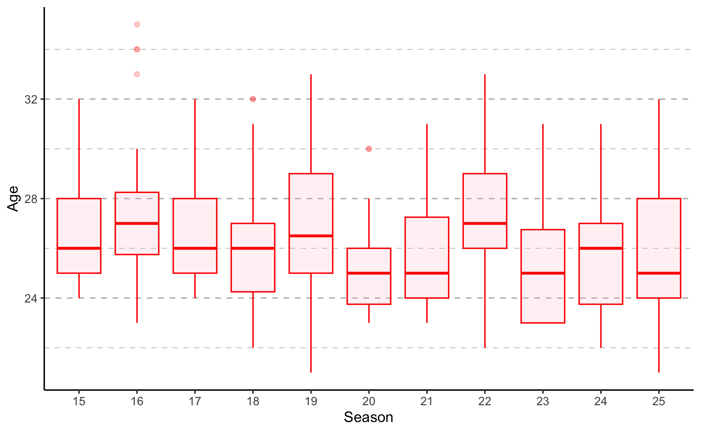
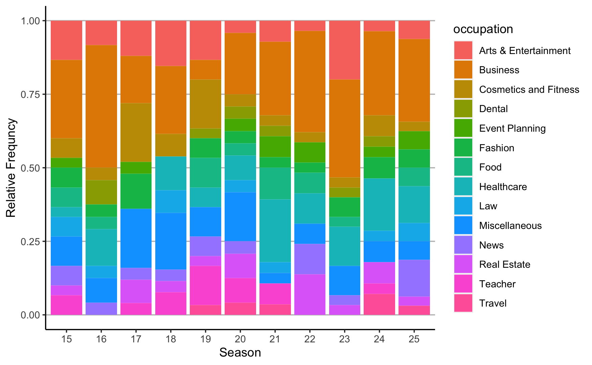
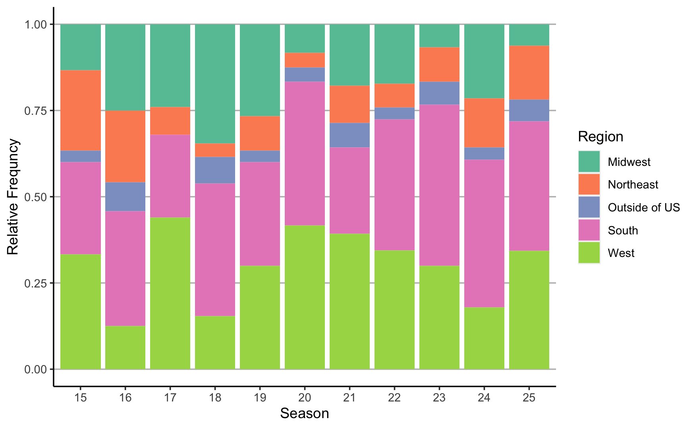
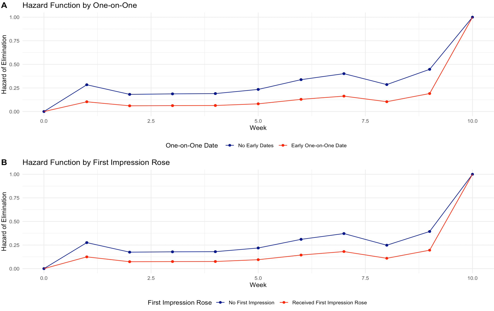
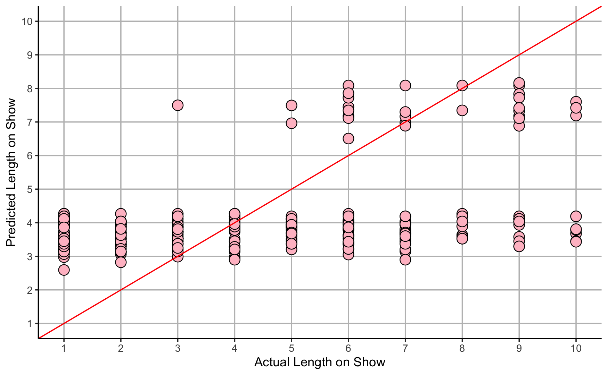

```{r setup, include=FALSE}
knitr::opts_chunk$set(echo = TRUE)
library(rmdformats)
```


# Introduction

## Background
The Bachelor is an American reality TV show in which an individual, cast as the bachelor, selects his potential wife from a pool of ~30 women contestants.$^1$ The show gained notoriety because of the elimination style format in which roses signify whether the lead wants to continue pursuing a relationship, and, thus, whether or not a contestant remains in the competition. Set over the course of a few months, the contestants vie for the lead's heart during one-on-one dates and group-dates taking place around the globe. Usually, eliminations take place on dates or in rose ceremonies at the end of the week and the show culminates in a marriage proposal to the woman who receives 'the final rose.' In recent years, the show has been shifted away from the traditional format, including more unplanned eliminations, and fewer marriage proposals. With this increasing uncertainty, there is an opportunity to use data to quantify the probability of winning, and length of stay on the show. 

Bachelor seasons garner anywhere from 5 to 15 million viewers.$^1$ There has been a recent rise in "Bachelor Fantasy Leagues," in which people compete over when certain contestants will be eliminated by filling out brackets for the season. Often, both bragging rights and money are at stake. Thus, predicting not only the winners of the reality TV show is of interest to viewers but also the length of time on the show.

The goal of this analysis was to determine whether data from the first two weeks of the show could be used to predict the winner of the season and also the average length of stay on the show. Using data scraped from Wikipedia webpages for each Bachelor season, two classes of regression models were used to answer this question. A pooled logistic regression model was used, with time included as indicator variables for each week of the show, to model the conditional probability of being eliminated given demographic characteristics and show factors, and a logistic regression without time was used to model the probability of winning the show  demographic characteristics and show factors. Next, a linear regression model was used to model the average length on the show given demographic characteristics and show factors. Models were selected based on accuracy, root mean square error (MSE) and akaike information criterion (AIC). 


## Description of Data
To date, there have been 26 seasons of The Bachelor and approximately 30 contestants per season. Previous researchers have explored using publicly available data on The Bachelor to create prediction models to identify winners of each season. However, this data lacked demographic characteristics and had a different format, making it difficult to merge the data from Wikipedia about contestants with the existing dataset. Moreover, the most recent 4 seasons were not included in this dataset. Therefore, a novel Bachelor dataset was created by web scraping Wikipedia pages using the `rvest` package in R. Data were formatted using R Packages `tidyverse` and `lubridate`.

In this analysis, data from the seasons 15-25 were used as these were the seasons in which the rules of the show have been increasingly abandoned.$^{2-12}$ Season 26 was excluded from current analyses as there was no winner of the show. A total of 306 contestants were included in the dataset, with one winner from each season. 


## Exploratory Data Analysis

Results from the exploratory data analysis can be found in Table 1. Across seasons, the average age of contestants was 26 years old. Most contestants were from the South (35.0%) or the West (30.4%) in the US, while only 5% of contestants were from outside of the US. The most popular job sectors of contestants included business (25.8%), healthcare (10.8%), miscellaneous (10.5%), and arts & entertainment (9.8%). Those who won the Bachelor were more likely to be from the Western US, work in the Arts & Entertainment, Healthcare or Event Planning industries. The age of contestants was similar among winners and other contestants.

#### Table 1 Contestants demographic information 

|         |   **Winners**    |   **Other Contestant**    |   **All** |
|:----------|:----------|:-----------|:---------|
| Age *(average in years)* |   26.1	 |   26.3 |   26.3 |
| **Region**     |       |         |       |
| Midwest     |  20.0%     |   17.9%      |   18.0%    |
| Northeast   |  0.0%     |    12.2%    |   11.8%    |
| South       |   30.0%    |    35.1%     |   4.9%    |
| West        |   40.0%    |   30.1%      |   35.0%    |
| Outside of US     |   10.0%    |  4.7%       |  30.4%     |
| **Occupation**    |       |         |       |
| Arts & Entertainment  |  30.0%   |  9.1%     |   9.8%    |
| Business              |  0.0%   |  26.7%     |   25.8%    |   
| Cosmetics and Fitness |  0.0%   | 7.4%      |   7.2%    |   
| Dental                |  0.0%  | 2.4%      |    2.3%   |      
| Event Planning        |  10.0%   | 3.0%      |  3.3%     |       
| Fashion               |  0.0%   | 5.7%      |   5.6%    |      
| Food                  |  0.0%   | 5.1%       |  4.9%     |      
| Healthcare            |  30.0%   | 10.1%      | 10.8%      |       
| Law                   |  0.0%  | 3.4%       |   3.3%    |   
| Miscellaneous         |  0.0%   | 10.8%       |  10.5%     |       
| News                  |  10.0%   | 5.1%      |   5.2%    |     
| Real Estate           |  0.0%   | 5.1%      |    4.9%   |       
| Teacher                |  10.0%   | 4.4%     |   4.6%    |       
| Travel               |  10.0%   | 1.7%      |   2.0%    | 

The age, occupation, and hometown region were similar across seasons. Figures 1-3 depict the distribution of these characteristics.

#### Figure 1: Age of contestants on seasons 15-25. 


    
#### Figure 2: Occupation of contestants on seasons 15-25. 




#### Figure 3: Hometown region of contestants on seasons 15-25. 


# Results

## Data Wrangling
Data used in these analyses came from Wikipedia webpages for each Bachelor season. Characteristics of contestants were pulled first, including name, age, hometown, occupation, and the place in which they came in the competition. Data on contestants from each season's Wikipedia pages were merged into a large dataset containing  demographic information about contestants from all included seasons (`contestants_all`). A sample of this raw dataset is displayed in Table 2.


#### Table 2.  Sample of Merged Dataset Scraped from Bachelor Wikipedia Pages on Contestants

| column_label | Name | Age | Hometown | Occupation | Outcome | Place | Ref | Arrive | 
|:-------------------------------|:----------|:-----|:-------------|:----------|:---------|:------|:---|:----|
https://en.wikipedia.org/wiki/The_Bachelor_(American_season_15) |	Emily Maynard[7] |	24 |	Morgantown, West Virginia |	Children's Hospital Event Planner	| Winner | 	1	| [8]	| NA |
https://en.wikipedia.org/wiki/The_Bachelor_(American_season_15)	| Chantal O'Brien[9] |	28	| Mercer Island, Washington |	Executive Assistant |	Runner-up |	2 |	[8]	| NA |
https://en.wikipedia.org/wiki/The_Bachelor_(American_season_15)	| Ashley Hebert[10]	| 26 |	Madawaska, Maine |	Dental Student | 	Week 9 |	3	 | [11]	| NA |

*Note: not all columns or rows included in the dataset are included in the above table*

Another dataset was created from the elimination tables from each season's Wikipedia page (`elimination_all`). The elimination table on Wikipedia contained lists of the contestants remaining each week. A sample of this raw dataset is displayed in Table 3.

#### Table 3.  Sample of Merged Dataset Scraped from Bachelor Wikipedia Pages on Eliminations 

| column_label	| Order	| Bachelorettes	|  Week...3 |	 Week...4 | Week...5	|  ... |  Week...12 |
|:----------------|:-----|:---------|:-------|:-------|:-------|:-------|:-------|
https://en.wikipedia.org/wiki/The_Bachelor_(American_season_15)	|Order	|Bachelorettes |	1 |	2 |	3	| …	| 10 |
https://en.wikipedia.org/wiki/The_Bachelor_(American_season_15)	|1	    |Chantal	      |Ashley S.	| Ashley H. |	Ashley S.	| …	| Emily |
https://en.wikipedia.org/wiki/The_Bachelor_(American_season_15)	|2	    |Kimberly	      |Michelle	| Michelle |	Shawntel	…	| Chantal |

*Note: not all columns or rows included in the dataset are included in the above table*

Additional data were scraped manually from the "Episodes" section of the page on whether contestants received the first impression rose, and a one-on-one date within the first few weeks. The first impression rose is the first rose given out on the first night of the show, symbolizing that the contestant made a lasting impression on the lead, and has been previously proposed to be a good indicator of how long a contestant will stay on the show. One-on-one dates are opportunities for contestants to have alone time with the lead, and may represent a lead's interest in the contestants. These data were merged to the `elimination_all` dataset.

In the demographic dataset, contestants were referred to by their first and last name, as well as their nick name in quotes, when applicable, whereas  in the elimination dataset, contestants were referred to by their first name, nickname, or first name and last initial, when multiple contestants within a season had the same name. To merge these datasets, a new column was created in the demographic dataset that parsed and combined the first and last name initial, and replaced the first name with a nickname. Data cleaning was also needed for the occupation and hometown variables to then create new variables for occupations grouped into industrial sectors and hometowns into regions of the US. Industry sector and regions of the US were taken from Wikipedia.$^{13-14}$ Table 4 contains a sample of the cleaned and merged dataset used to predict the winner of the Bachelor and the length of stay on the show.

#### Table 4. Sample of Cleaned Dataset for Predicting the Winner of the Bachelor

| Season | Name | Age | Winner | Contestant State | Occupation | Home State | First Impression Rose | First One on One |
|:-----|:--------------------|:------|:------|:-----------------|:--------------|:----------|:--------------|:--------------|
| 15     | Alli Travis | 24 | 0 | Ohio | Fashion | Midwest | 0 | 0 |
| 15     | Ashley Hebert         | 26 | 0 | Maine | Healthcare | Northeast | 0 |  1 |
| 15     | Ashley Spivey         | 26   | 0 |  North Carolina | Miscellaneous | South | 1 |  0 |
| 15     | Britnee Marks         | 25  | 0 | Pennsylvania | Law | Northeast | 0 | 0 |
| 15     | Britt Billmaier       | 25   |  0 | Washington | News | West | 0 |  0 |
| 15     | Chantal O'Brien       | 28    | 0  | Washington | Business | West | 0 |  0 |
| 15     | Cristy Caserta        | 30  | 0  | Florida | Law | South | 0 |  0 |
| 15     | Emily Maynard         | 24   | 1 | West Virginia | Event Planning | South | 0 |  0 |
| 15     | J Adams     | 26   | 0  | Washington | Business | West | 0 |  0 |
| 15     | Jackie Gordon         | 26   | 0  | Rhode Island | Arts & Entertainment | Northeast | 0 | 0 |
| 15     | Jill Ruskowski        |  28   | 0   | Texas | Business | South | 0 | 1 |      

*Note: not all columns or rows included in the dataset are included in the above table*


For the survival analysis, data were converted from the wide to a long format using the `tidyverse` package, `pivot_longer` function. In this dataset, each row corresponding to all of the time-points at which individuals were 'at risk' for elimination, as well as the week during which the individual was eliminated. Indicator variables were created for each week, from week 0 (beginning of first episode) to week 10 (end of last episode). All individuals were 'at risk' at week 0. As soon as an individual is eliminated, they stop contributing to the dataset. Table 5 contains a sample of the survival dataset used to calculate the discrete hazard of elimination.


#### Table 5. Sample of Cleaned Dataset for Survival Analysis

| Season | Name              | Outcome | Week 0 | Week 1 |  Week 2 | Week 3 |  Week 4 | Week 5 |  Week 6 | Week 7 |  Week 8 | Week 9 |  Week 10 |
|:-------|:---------------------|:---------|:---------|:---------|:---------|:---------|:---------|:---------|:---------|
| 25 | Abigail Heringer  | 0 |W 0  | 0 | 1 | 0 | 0 | 0 | 0 | 0 | 0 | 0 | 0 | 0 | 0 |
| 25 | Abigail Heringer  | 0 |W 1 | 0 | 0 | 1 | 0 | 0 | 0 | 0 | 0 | 0 | 0 | 0 | 0 |
| 25 | Abigail Heringer  | 0 |W 2 | 0 | 0 | 0 | 1 | 0 | 0 | 0 | 0 | 0 | 0 | 0 | 0 |
| 25 | Abigail Heringer  | 0 |W 3 | 0 | 0 | 0 | 0 | 1 | 0 | 0 | 0 | 0 | 0 | 0 | 0 |
| 25 | Abigail Heringer  | 0 |W 4 | 0 | 0 | 0 | 0 | 0 | 1 | 0 | 0 | 0 | 0 | 0 | 0 |
| 25 | Abigail Heringer  | 0 |W 5 | 0 | 0 | 0 | 0 | 0 | 0 | 1 | 0 | 0 | 0 | 0 | 0 |
| 25 | Abigail Heringer  | 0 |W 6 | 0 | 0 | 0 | 0 | 0 | 0 | 0 | 1 | 0 | 0 | 0 | 0 |
| 25 | Abigail Heringer  | 1 |W 7 | 1 | 0 | 0 | 0 | 0 | 0 | 0 | 1 | 0 | 0 | 0 | 0 |
| 25 | Alana Milne       | 0 |W 0 | 0 | 1 | 0 | 0 | 0 | 0 | 0 | 0 | 0 | 0 | 0 | 0 |
| 25 | Alana Milne       | 1 |W 1 | 1 | 0 | 1 | 0 | 0 | 0 | 0 | 0 | 0 | 0 | 0 | 0 |

  
## Regression Model Development and Selection

Variables available within the first two weeks of the show were candidates for the prediction models, as usually the Bachelor Leagues require viewers to finalize their brackets by the end of the second week of the show. These included `age`, as a continuous variable, `region`, as four indicator variables for Northeast, Outside of US, South, and West, with a reference level of Midwest, `OneOnOne`, a binary variable representing whether a contestant received a one-on-one date within the first two weeks, and `FirstImpression`, a binary variable representing whether a contestant received the first impression rose.

### Probability of Winning: Logistic Regression
Three models were developed to examine the probability of winning The Bachelor. Model 1 contained only bachelor-specific variables `OneOnOne`, and `FirstImpression`, while Model 2 contained only demographic variables `Age`, `Region` and `Occupation`. Model 3 contained `Age`, `Region`, `OneOnOne`, and `FirstImpression`. `Occupation` was excluded due to overfitting concerns.  Accuracy and AIC were compared to determine the final model. Accuracy was comparable across models (~96%) while AIC was lowest for Model 3, thus Model 3 was selected as the final prediction model.

$$ logit(\text{w}=1)=\beta_0+\beta_1Age + \beta_2Northeast + \beta_3South + \beta_4OutsideUS + \beta_5West + \beta_6OneOnOne+\beta_7FirstImpression $$ 

Probabilities of winning the show were calculated using the coefficients from the final model. 

\small
$$P(w=1)=\frac{e^{5.77+Age*(-0.08)+Northeast*(-0.5)+OutsideUS*(-0.12)+South*(0.25)+West*(-0.34)+OneOnOne*(3.40)+FirstImpression*(3.45)}}{1+e^{5.77+Age*(-0.08)+Northeast*(-0.5)+OutsideUS*(-0.12)+South*(0.25)+West*(-0.34)+OneOnOne*(3.40)+FirstImpression*(3.45)}}$$ 

The contestant with the highest probability of winning the show was Kaitlyn Bristowe, a 29 year old from Canada who worked in the Arts & Entertainment industry and went on a one-on-one date within the first two weeks. This individual did not win but was the runner-up for the season.

### Risk of Elimination: Survival Analysis
Three models were developed to examine the hazard of being eliminated. Time was modeled discretely, using 11 indicator variables corresponding to the beginning of the first episode `week.0` and the end of the last episode `week.final`. All models included `time` as 9 indicator variables. Model 1 contained only bachelor-specific variables `OneOnOne`, and `FirstImpression`, while Model 2 contained only demographic variables `Age`, `Region` and `Occupation`. Model 3 contained `Age`, `Region`, `Occupation`, `OneOnOne`, and `FirstImpression`. The inclusion of the interaction term allowed the hazard of being eliminated over time to vary based on whether an individual received the first impression rose. AIC was compared across models and used to select the final model. Model 3 was selected. 

The hazard of being eliminated was 74.4% lower for individuals who went on a one-on-one date within the first two weeks, conditional upon other covariates, and 67.4% lower for individuals who received the first impression rose, conditional upon covariates. Both results were significant at p < 0.001 level. These results indicate that receiving one of the first one-on-one dates or receiving the first impression rose greatly decreases chances of being eliminated. These estimates are consistent with the plots demonstrating the hazard of elimination over time. Figure 4A depicts the hazard stratified by having a one-on-one and Figure 4B depicts the hazard stratified receiving the first impression rose. We can see that both of these factors similarly affect the elimination hazard, such that receiving either a one-on-one or the first impression rose is protective against elimination. 

#### Figure 4: Discrete hazard of elimination, 

  


### Length on the Show: Linear Regression 
Three models were developed to examine the hazard of being eliminated. Time was modeled discretely, using 11 indicator variables corresponding to the beginning of the first episode `week.0` and the end of the last episode `week.final`. All models included `time` as 9 indicator variables. Model 1 contained only bachelor-specific variables `OneOnOne`, and `FirstImpression`, while Model 2 contained only demographic variables `Age`, `Region` and `Occupation`. Model 3 contained `Age`, `Region`, `OneOnOne`,  and  `FirstImpression`. Model 3 excluded `Occupation` as it did not improve model fit (as indicated by larger AIC). AIC and RMSE were compared across models and used to select the final model. Model 1 had the lowest AIC (1448) while Model 3 had the lowest RMSE (2.52). As the AIC for Model 3 was only slightly higher (1452), Model 3 was selected as the final model.

$$ length.on.show=\beta_0 + \beta_1Age + \beta_2Northeast + \beta_3OutsideUS + \beta_4South + \beta_5West + \beta_6OneOnOne + \beta_7FirstImpression$$

Figure 5 shows a plot comparing the length of stay predicted by Model 3 to the actual length of stay. Though this was the best model of those developed, from this plot it's clear that this model is unable to accurately predict the length of stay for those at the extremes, i.e., those who are eliminated the first night, or those who make it to the end of the show. 


#### Figure 5: Observed vs. predicted length of time on the show.



# Conclusion
The goal of this analysis was to determine whether data available within the first few weeks of the show, could be used to predict the winner and length of time on the show. The main component of this analysis was creating a novel dataset with data on contestants and eliminations from data available online. Two datasets were successfully created for modelling the outcome of winning the show and length of time on the show, as well as the hazard of being eliminated. Based on three modelling strategies, characteristics of the ideal contestant include being from the Western US, getting one of the first one-on-one dates, and working in the Arts & Entertainment or Business industry. However, none of these models appeared to do very well in predicting the winner or the length of time on the show. These models may help guide viewers in creating Bachelor brackets but should be interpreted and used with caution.

One reason for the limited predictive ability of these models may be due to the nature of the show. Former Bachelor leads have recently started disclosing the influential role of producers on their journey to find love. Unfortunately data on the producers role is unmeasured, and thus presents an issue of omitted variable bias for which it is likely impossible to quantify using traditional methods. One option could be to explore a Bayesian approach in which a prior is introduced that influences the prediction based on whether there is thought to be a strong or minor influence of the producers.  

Cross-validation to assess the performance of the model was considered but due to the limited number of people who won, this caused problems while running the logistic regression models. This analysis could be extended with additional web scraping for the earlier seasons. As mentioned previously, due to the changing in the format of the show, data from earlier seasons may not be as informative for later seasons. However, this is another question that could be investigated with additional data.

Another variable that may have influence on the outcomes of interest is the type of date contestants have. Some researchers have proposed that contestants that go on scarier or high-stress dates often end up going further in the show; adrenaline-inducing activities have been found to promote bonding.$^{15}$ Previous dates on this show have included sky diving, bungee jumping and zero gravity flights. Anecdotally, contestants who go on these types of dates seem to often get to the final three. However, data on the types of dates was not readily available and would require either extensive web-scraping, or re-watching the show.

So for now, based on current data and resources, love does truly seem to be unpredictable.


# References
1. The Bachelor (American TV series) (n.d.). In Wikipedia. Retrieved December 10, 2022, from https://en.wikipedia.org/wiki/The_Bachelor_(American_TV_series)

2. The Bachelor (American season 15) (n.d.). In Wikipedia. Retrieved December 10, 2022, from https://en.wikipedia.org/wiki/The_Bachelor_(American_season_15)

3. The Bachelor (American season 16) (n.d.). In Wikipedia. Retrieved December 10, 2022, from https://en.wikipedia.org/wiki/The_Bachelor_(American_season_16)

4. The Bachelor (American season 17) (n.d.). In Wikipedia. Retrieved December 10, 2022, from https://en.wikipedia.org/wiki/The_Bachelor_(American_season_17)

5. The Bachelor (American season 18) (n.d.). In Wikipedia. Retrieved December 10, 2022, from https://en.wikipedia.org/wiki/The_Bachelor_(American_season_18)

6. The Bachelor (American season 19) (n.d.). In Wikipedia. Retrieved December 10, 2022, from https://en.wikipedia.org/wiki/The_Bachelor_(American_season_19)

7. The Bachelor (American season 20) (n.d.). In Wikipedia. Retrieved December 10, 2022, from https://en.wikipedia.org/wiki/The_Bachelor_(American_season_20)

8. The Bachelor (American season 21) (n.d.). In Wikipedia. Retrieved December 10, 2022, from https://en.wikipedia.org/wiki/The_Bachelor_(American_season_21)

9. The Bachelor (American season 22) (n.d.). In Wikipedia. Retrieved December 10, 2022, from https://en.wikipedia.org/wiki/The_Bachelor_(American_season_22)

10. The Bachelor (American season 23) (n.d.). In Wikipedia. Retrieved December 10, 2022, from https://en.wikipedia.org/wiki/The_Bachelor_(American_season_23)

11. The Bachelor (American season 24) (n.d.). In Wikipedia. Retrieved December 10, 2022, from https://en.wikipedia.org/wiki/The_Bachelor_(American_season_24)

12. The Bachelor (American season 25) (n.d.). In Wikipedia. Retrieved December 10, 2022, from https://en.wikipedia.org/wiki/The_Bachelor_(American_season_25)

12. The Bachelor (American season 25) (n.d.). In Wikipedia. Retrieved December 10, 2022, from https://en.wikipedia.org/wiki/The_Bachelor_(American_season_25)

13. Economy of the United States by sector (n.d.). In Wikipedia. Retrieved December 10, 2022, from https://en.wikipedia.org/wiki/Economy_of_the_United_States_by_sector

14. List of regions of the United States (n.d.). In Wikipedia. Retrieved December 10, 2022, from https://en.wikipedia.org/wiki/List_of_regions_of_the_United_States

15. Dutton, D. G., & Aron, A. P. (1974). Some evidence for heightened sexual attraction under conditions of high anxiety. Journal of Personality and Social Psychology, 30(4), 510-517. doi:10.1037/h0037031


# Appendix 

#### Installing relevant libraries and packages
```{r library-setup, include=TRUE, eval=FALSE}

library(tidyverse)
library(lubridate)
library(rvest)
library(dplyr)
library(sjmisc)
library(caret)
library(ggpubr)

RMSE<-function(true, predicted){
    sqrt(mean((true - predicted)^2))
}

```


### Reading in data from each season

```{r contestants-all, include=TRUE, eval=FALSE}

url <- "https://en.wikipedia.org/wiki/The_Bachelor_(American_season_"
pages <- paste0(url, 15:25, ")")
pages

contestants <- sapply(pages, function(i){
  season <- read_html(i)
  tab <- season |> html_nodes("table")
  as.data.frame(html_table(tab[[2]], trim=TRUE, convert = FALSE))
})

contestants_all <- bind_rows(contestants, .id = "column_label")

contestants_all <-contestants_all |> 
  mutate(Season = str_extract(column_label, '\\d+\\d'),
         Name = str_extract(Name, "([^\\[]+)" ),
         Name = str_extract(Name,"([^(]+)"),
         winner = ifelse(Outcome=="Winner",1,0),
         left_competition = case_when(Age=="(Returned to competition)" ~ 1,
                                      grepl("DQ", Place)==T ~ 1,
                                      grepl("quit", Place)==T ~ 1,
                                      TRUE ~ 0),
         contestant_city = str_extract(Hometown, "[^,]+"),
         contestant_state = str_extract(Hometown, "(?<=,)[^,]+"),
         LastInitial = substr(str_extract(Name, "[^ ]+$" ),1,1),
         FirstName = str_extract(Name, '.+?(?= )'),
         FirstName = ifelse(Name=="Rebecca", "Rebecca", FirstName),
         FirstName = ifelse(Name=="Blakeley Jones ", "Blakeley", FirstName),
         LastInitial = ifelse(Name=="Blakeley Jones ", "J", LastInitial),
         NickName = str_extract(Name, '(?<=")(.+)(?=\\")'))  |>
  subset(Age!="(Returned to competition)") |>
  select(-c(Ref, Arrived, column_label))


```

#### Getting elimination data

```{r elimination-all, include=TRUE, eval=FALSE}

new_url <- "https://en.wikipedia.org/wiki/The_Bachelor_(American_season_"
new_pages <- paste0(url, 15:25, ")")


elimination <- sapply(new_pages, function(i){
  season <- read_html(i)
  tab <- season |> html_nodes("table")
  as.data.frame(html_table(tab[[3]], trim=TRUE, convert = FALSE))
})


elimination_all <- bind_rows(elimination, .id = "column_label")

```


#### Cleaning Season 15 Data
```{r season-15, include=TRUE, eval=FALSE}


season_15<-elimination_all |>
  subset(column_label==new_pages[1] & Bachelorettes!="Bachelorettes") |>
  mutate(name=str_extract(Bachelorettes, "[^.]+"),
         Season = str_extract(column_label, '\\d+\\d'),
         Bachelorettes=str_extract(Bachelorettes,"([^\\[]+)"))


#####  Defining the roses and eliminations 
# Roses

roses15_1<-season_15[1:20,4]
roses15_2<-season_15[1:17,5]
roses15_3<-season_15[1:14,6]
roses15_4<-season_15[1:11,7]
roses15_5<-season_15[1:8,8]
roses15_6<-season_15[1:6,9]
roses15_7<-season_15[1:4,10]


# Eliminations
eliminated15_1<-unlist(strsplit(gsub('([a-z])(?=[A-Z])','\\1,',season_15[21,4],perl=T), "[[:punct:]]"))
eliminated15_2<-unlist(strsplit(gsub('([a-z])(?=[A-Z])','\\1,',season_15[18,5],perl=T), "[[:punct:]]"))
eliminated15_3<-unlist(strsplit(gsub('([a-z])(?=[A-Z])','\\1,',season_15[15,6],perl=T), "[[:punct:]]"))
eliminated15_4<-unlist(strsplit(gsub('([a-z])(?=[A-Z])','\\1,',season_15[12,7],perl=T), "[[:punct:]]"))
eliminated15_5<-unlist(strsplit(gsub('([a-z])(?=[A-Z])','\\1,',season_15[9,8],perl=T), "[[:punct:]]"))
eliminated15_6<-unlist(strsplit(gsub('([a-z])(?=[A-Z])','\\1,',season_15[7,9],perl=T), "[[:punct:]]"))


season_15<-season_15 |>
  mutate(ELIMINATION.1=case_when(Bachelorettes== "Ashley S." ~ "R1",
                                 Bachelorettes  %in% roses15_1 == T ~ "R",
                                 name %in% c("J", "Jill") == T ~ "E",
                                 name %in% eliminated15_1 == T ~ "E"),
         
         ELIMINATION.2=case_when(Bachelorettes  %in% roses15_2 == T ~ "R",
                                 name %in% eliminated15_2 == T ~ "E"),
         
         ELIMINATION.3=case_when(Bachelorettes  %in% roses15_3 == T ~ "R",
                                 name %in% eliminated15_3 ==T ~ "E",
                                 Bachelorettes=="Madison" ~ "EQ"),
         
         ELIMINATION.4=case_when(Bachelorettes  %in% roses15_4 == T ~ "R",
                                 name %in% eliminated15_4 == T ~ "E"),
         
         ELIMINATION.5=case_when(Bachelorettes  %in% roses15_5 == T ~ "R",
                                 name  %in% eliminated15_5 == T ~ "E",
                                 Bachelorettes=="Ashley S." ~ "ED"),

         ELIMINATION.6=case_when(Bachelorettes  %in% roses15_6 == T ~ "R",
                                 name  %in% eliminated15_6 == T ~ "E",
                                 Bachelorettes=="Alli" ~ "ED"),
         
         ELIMINATION.7=case_when(Bachelorettes  %in% roses15_7 == T ~ "R",
                                 Bachelorettes == "Michelle"  ~ "E",
                                 Bachelorettes == "Britt"  ~ "ED"),
                                 
         ELIMINATION.8=case_when(Bachelorettes %in%  c("Ashley H.", "Emily", "Chantal") == T ~ "R",
                                 Bachelorettes == "Shawntel" ~ "E"),
         
         ELIMINATION.9=case_when(Bachelorettes %in%  c("Emily", "Chantal") == T ~ "R",
                                 Bachelorettes ==  "Ashley H."~ "EU"),
         
         ELIMINATION.10=case_when(Bachelorettes ==  "Emily" ~ "R",
                                  Bachelorettes =="Chantal" ~ "E"),
                  OneOnOne=case_when( Bachelorettes %in% c("Ashley H.", "Jackie", "Ashley S.", "Ali",  "Michelle", "Britt") == T ~ 1,
                    Bachelorettes %in% c("Chantal", "Emily", "Shawntel" ) == T ~ 2,
                    T ~ 0),
         
         first_1.1=ifelse(Bachelorettes %in% c("Ashley H.", "Jackie"),1,0),
         
         group.date.rose=case_when(Bachelorettes %in% c("Michelle", "Emily", "Shawntel", "Britt", "Ashley H.") == T ~ 1,
                              TRUE ~ 0))|>
           dplyr::select(Season, name, Bachelorettes, ELIMINATION.1, ELIMINATION.2,ELIMINATION.3, ELIMINATION.4,ELIMINATION.5,ELIMINATION.6,ELIMINATION.7,ELIMINATION.8,ELIMINATION.9,ELIMINATION.10, OneOnOne, group.date.rose, first_1.1)

```


#### Cleaning Season 16 Data
```{r season-16, include=TRUE, eval=FALSE}

season_16<-elimination_all |>
  subset(column_label==new_pages[2] & Bachelorettes!="Bachelorettes") |>
  mutate(name=str_extract(Bachelorettes, "[^.]+"),
         Season = str_extract(column_label, '\\d+\\d'),
         Bachelorettes=str_extract(Bachelorettes,"([^\\[]+)"))


#####  Defining the roses and eliminations  
# Roses
roses16_1<-season_16[1:18,14]
roses16_2<-season_16[1:16,15]
roses16_3<-season_16[1:13,16]
roses16_4<-season_16[1:11,17]
roses16_5<-season_16[1:9,18]
roses16_6<-season_16[1:6,19]
roses16_7<-season_16[1:4,20]
roses16_8<-season_16[1:3,21]
roses16_9<-season_16[1:2,22]


# Eliminations
eliminated16_1<-unlist(strsplit(gsub('([a-z])(?=[A-Z])','\\1,',season_16[19,14],perl=T), "[[:punct:]]"))
eliminated16_2<-unlist(strsplit(gsub('([a-z])(?=[A-Z])','\\1,',season_16[17,15],perl=T), "[[:punct:]]"))
eliminated16_3<-unlist(strsplit(gsub('([a-z])(?=[A-Z])','\\1,',season_16[14,16],perl=T), "[[:punct:]]"))
eliminated16_4<-unlist(strsplit(gsub('([a-z])(?=[A-Z])','\\1,',season_16[12,17],perl=T), "[[:punct:]]"))
eliminated16_5<-unlist(strsplit(gsub('([a-z])(?=[A-Z])','\\1,',season_16[9,18],perl=T), "[[:punct:]]"))
eliminated16_6<-unlist(strsplit(gsub('([a-z])(?=[A-Z])','\\1,',season_16[7,19],perl=T), "[[:punct:]]"))


season_16<-season_16 |>
  mutate(ELIMINATION.1=case_when(Bachelorettes== "Lindzi C." ~ "R1",
                                 Bachelorettes  %in% roses16_1 == T ~ "R",
                                 name %in% eliminated16_1 == T ~ "E"),
         
         ELIMINATION.2=case_when(Bachelorettes  %in% roses16_2 == T ~ "R",
                                 name %in% eliminated16_2 == T ~ "E"),
         
         ELIMINATION.3=case_when(Bachelorettes  %in% roses16_3 == T ~ "R",
                                 name %in% eliminated16_3 ==T ~ "E",
                                 Bachelorettes=="Brittney" ~ "EQ"),
         
         ELIMINATION.4=case_when(Bachelorettes  %in% roses16_4 == T ~ "R",
                                 name %in% eliminated16_4 == T ~ "E",
                                 Bachelorettes=="Samantha" ~ "EU"),
         
         ELIMINATION.5=case_when(Bachelorettes  %in% roses16_5 == T ~ "R",
                                 name  %in% eliminated16_5 == T ~ "E",
                                 Bachelorettes=="Elyse" ~ "ED"),

         ELIMINATION.6=case_when(Bachelorettes  %in% roses16_6 == T ~ "R",
                                 name  %in% eliminated16_6 == T ~ "E",
                                 Bachelorettes=="Blakeley" ~ "ED",
                                 Bachelorettes=="Casey S." ~ "EU"),
         
         ELIMINATION.7=case_when(Bachelorettes  %in% roses16_7 == T ~ "R",
                                 Bachelorettes %in% c("Emily", "Rachel") == T  ~ "E"),
                                 
         ELIMINATION.8=case_when(Bachelorettes %in%  roses16_8 == T ~ "R",
                                 Bachelorettes == "Kacie B." ~ "E"),
         
         ELIMINATION.9=case_when(Bachelorettes %in%  roses16_9 == T ~ "R",
                                 Bachelorettes ==  "Nicki"~ "E"),
         
         ELIMINATION.10=case_when(Bachelorettes ==  "Courtney" ~ "R",
                                  Bachelorettes =="Lindzi C." ~ "E"),
         OneOnOne=case_when( Bachelorettes %in% c("Rachel", "Jennifer", "Nicki", "Elyse") == T ~ 1,
                    Bachelorettes %in% c("Kacie B.","Lindzi C.","Courtney", "Emily") == T ~ 2,
                    T ~ 0),
         first_1.1=ifelse(Bachelorettes %in% c("Kacie B.", "Courtney"),1,0),
         
         group.date.rose=case_when(Bachelorettes %in% c("Blakeley", "Rachel", "Courtney", "Lindzi C.") == T ~ 1,
                                   Bachelorettes == "Kacie B." ~ 2,
                              TRUE ~ 0)) |>
           dplyr::select(Season, name, Bachelorettes, ELIMINATION.1, ELIMINATION.2,ELIMINATION.3, ELIMINATION.4,ELIMINATION.5,ELIMINATION.6,ELIMINATION.7,ELIMINATION.8,ELIMINATION.9,ELIMINATION.10, OneOnOne, group.date.rose, first_1.1)

```


#### Cleaning Season 17 Data
```{r season-17, include=TRUE, eval=FALSE}

season_17<-elimination_all |>
  subset(column_label==new_pages[3] & Bachelorettes!="Bachelorettes") |>
  mutate(name=str_extract(Bachelorettes, "[^.]+"),
         Season = str_extract(column_label, '\\d+\\d'))


#####  Defining the roses and eliminations  
# Roses
roses17_1<-season_17[1:19,4]
roses17_2<-season_17[1:16,5]
roses17_3<-season_17[1:13,6]
roses17_4<-season_17[1:11,7]
roses17_5<-season_17[1:9,8]
roses17_6<-season_17[1:6,9]
roses17_7<-season_17[1:4,10]
roses17_8<-season_17[1:3,11]
roses17_9<-season_17[1:2,12]


# Eliminations
eliminated17_1<-unlist(strsplit(gsub('([a-z])(?=[A-Z])','\\1,',season_17[20,4],perl=T), "[[:punct:]]"))
eliminated17_2<-unlist(strsplit(gsub('([a-z])(?=[A-Z])','\\1,',season_17[17,5],perl=T), "[[:punct:]]"))
eliminated17_3<-unlist(strsplit(gsub('([a-z])(?=[A-Z])','\\1,',season_17[14,6],perl=T), "[[:punct:]]"))
eliminated17_4<-unlist(strsplit(gsub('([a-z])(?=[A-Z])','\\1,',season_17[12,7],perl=T), "[[:punct:]]"))
eliminated17_5<-unlist(strsplit(gsub('([a-z])(?=[A-Z])','\\1,',season_17[9,8],perl=T), "[[:punct:]]"))
eliminated17_6<-unlist(strsplit(gsub('([a-z])(?=[A-Z])','\\1,',season_17[7,9],perl=T), "[[:punct:]]"))


season_17<-season_17 |>
  mutate(ELIMINATION.1=case_when(Bachelorettes== "Sharleen" ~ "R1",
                                 Bachelorettes  %in% roses17_1 == T ~ "R",
                                 name %in% eliminated17_1 == T ~ "E"),
         
         ELIMINATION.2=case_when(Bachelorettes  %in% roses17_2 == T ~ "R",
                                 name %in% eliminated17_2 == T ~ "E",
                                 Bachelorettes=="Katie" ~ "EQ"),
         
         ELIMINATION.3=case_when(Bachelorettes  %in% roses17_3 == T ~ "R",
                                 name %in% eliminated17_3 == T ~ "E",
                                 Bachelorettes=="Kacie" ~ "EU"),
         
         ELIMINATION.4=case_when(Bachelorettes  %in% roses17_4 == T ~ "R",
                                 name %in% eliminated17_4 == T ~ "E",
                                 Bachelorettes=="Leslie H." ~ "ED"),
         
         ELIMINATION.5=case_when(Bachelorettes  %in% roses17_5 == T ~ "R",
                                 name  %in% eliminated17_5 == T ~ "E",
                                 Bachelorettes=="Jackie" ~ "ED"),

         ELIMINATION.6=case_when(Bachelorettes  %in% roses17_6 == T ~ "R",
                                 name  %in% eliminated17_6 == T ~ "E",
                                 Bachelorettes=="Sarah" ~ "EU"),
         
         ELIMINATION.7=case_when(Bachelorettes  %in% roses17_7 == T ~ "R",
                                 Bachelorettes == "Lesley M."  ~ "E",
                                 Bachelorettes == "Tierra"  ~ "EU"),
                                 
         ELIMINATION.8=case_when(Bachelorettes %in%  roses17_8 == T ~ "R",
                                 Bachelorettes == "Desiree" ~ "E"),
         
         ELIMINATION.9=case_when(Bachelorettes %in%  roses17_9 == T ~ "R",
                                 Bachelorettes ==  "AshLee F."~ "E"),
         
         ELIMINATION.10=case_when(Bachelorettes ==  "Catherine" ~ "R",
                                  Bachelorettes =="Lindsay" ~ "E"),
         OneOnOne=case_when( Bachelorettes %in% c("Sarah", "Tierra", "Selma", "Leslie H.", "Lindsay", "Catherine") == T ~ 1,
                    Bachelorettes %in% c("Desiree", "AshLee F.", "Lesley M.") == T ~ 2,
                    T ~ 0),
         first_1.1=ifelse(Bachelorettes %in% c("Sarah", "Desiree"),1,0),
         group.date.rose=case_when(Bachelorettes %in% c("Kacie", "Tierra", "Daniella", "Lesley") == T ~ 1,
                                   Bachelorettes == "Lindsay" ~ 2,
                                   TRUE ~ 0)) |>
           dplyr::select(Season, name, Bachelorettes, ELIMINATION.1, ELIMINATION.2,ELIMINATION.3, ELIMINATION.4,ELIMINATION.5,ELIMINATION.6,ELIMINATION.7,ELIMINATION.8,ELIMINATION.9, ELIMINATION.10, OneOnOne, group.date.rose, first_1.1)
 
```


#### Cleaning Season 18 Data
```{r season-18, include=TRUE, eval=FALSE}

season_18<-elimination_all |>
  subset(column_label==new_pages[4] & Bachelorettes!="Bachelorettes") |>
  mutate(name=str_extract(Bachelorettes, "[^.]+"),
         Season = str_extract(column_label, '\\d+\\d'))

#####  Defining the roses and eliminations  
# Roses
roses18_1<-season_18[1:18,14]
roses18_2<-season_18[1:15,15]
roses18_3<-season_18[1:13,16]
roses18_4<-season_18[1:11,17]
roses18_5<-season_18[1:8,18]
roses18_6<-season_18[1:6,19]
roses18_7<-season_18[1:4,20]
roses18_8<-season_18[1:3,21]
roses18_9<-season_18[1:2,22]


# Eliminations
eliminated18_1<-unlist(strsplit(gsub('([a-z])(?=[A-Z])','\\1,',season_18[19,14],perl=T), "[[:punct:]]"))
eliminated18_2<-unlist(strsplit(gsub('([a-z])(?=[A-Z])','\\1,',season_18[16,15],perl=T), "[[:punct:]]"))
eliminated18_3<-unlist(strsplit(gsub('([a-z])(?=[A-Z])','\\1,',season_18[14,16],perl=T), "[[:punct:]]"))
eliminated18_4<-unlist(strsplit(gsub('([a-z])(?=[A-Z])','\\1,',season_18[12,17],perl=T), "[[:punct:]]"))
eliminated18_5<-unlist(strsplit(gsub('([a-z])(?=[A-Z])','\\1,',season_18[9,18],perl=T), "[[:punct:]]"))


season_18<-season_18 |>
  mutate(ELIMINATION.1=case_when(Bachelorettes== "Sharleen" ~ "R1",
                                 Bachelorettes  %in% roses18_1 == T ~ "R",
                                 name %in% eliminated18_1 == T ~ "E"),
         
         ELIMINATION.2=case_when(Bachelorettes  %in% roses18_2 == T ~ "R",
                                 name %in% eliminated18_2 == T ~ "E",
                                 Bachelorettes=="Victoria" ~ "EU"),
         
         ELIMINATION.3=case_when(Bachelorettes  %in% roses18_3 == T ~ "R",
                                 name %in% eliminated18_3 == T ~ "E"),
         
         ELIMINATION.4=case_when(Bachelorettes  %in% roses18_4 == T ~ "R",
                                 name %in% eliminated18_4 == T ~ "E"),
         
         ELIMINATION.5=case_when(Bachelorettes  %in% roses18_5 == T ~ "R",
                                 name  %in% eliminated18_5 == T ~ "E"),

         ELIMINATION.6=case_when(Bachelorettes  %in% roses18_6 == T ~ "R",
                                 Bachelorettes == "Cassandra" ~ "ED"),
         
         ELIMINATION.7=case_when(Bachelorettes  %in% roses18_7 == T ~ "R",
                                 Bachelorettes == "Chelsie"  ~ "E",
                                 Bachelorettes == "Sharleen"  ~ "EQ"),
                                 
         ELIMINATION.8=case_when(Bachelorettes %in%  roses18_8 == T ~ "R",
                                 Bachelorettes == "Renee" ~ "E"),
         
         ELIMINATION.9=case_when(Bachelorettes %in%  roses18_9 == T ~ "R",
                                 Bachelorettes ==  "Andi"~ "EQ"),
         
         ELIMINATION.10=case_when(Bachelorettes ==  "Nikki" ~ "R",
                                  Bachelorettes =="Clare" ~ "E"),
         OneOnOne=case_when( Bachelorettes %in% c("Kat", "Cassandra", "Chelsie", "Renee") == T ~ 1,
                    Bachelorettes %in% c("Clare","Sharleen","Nikki") == T ~ 2,
                    T ~ 0),
         first_1.1=ifelse(Bachelorettes %in% c("Clare", "Kat"),1,0),
         group.date.rose=case_when(Bachelorettes %in% c("Kelly", "Clare", "Sharleen") == T ~ 1,
                                   Bachelorettes %in% c("Nikki", "Andi") == T  ~ 2,
                                   TRUE ~ 0)) |>
           dplyr::select(Season, name, Bachelorettes, ELIMINATION.1, ELIMINATION.2,ELIMINATION.3, ELIMINATION.4,ELIMINATION.5,ELIMINATION.6,ELIMINATION.7,ELIMINATION.8,ELIMINATION.9, ELIMINATION.10, OneOnOne, group.date.rose, first_1.1)


```

#### Cleaning Season 19 Data
```{r season-19, include=TRUE, eval=FALSE}

season_19<-elimination_all |>
  subset(column_label==new_pages[5] & Bachelorettes!="Bachelorettes") |>
  mutate(name=str_extract(Bachelorettes, "[^.]+"),
         Season = str_extract(column_label, '\\d+\\d'))


#####  Defining the roses and eliminations  
# Roses
roses19_1<-season_19[1:23,4]
roses19_2<-season_19[1:18,5]
roses19_3<-season_19[1:15,6]
roses19_4<-season_19[1:11,7]
roses19_5<-season_19[1:9,8]
roses19_6<-season_19[1:2,9]
roses19_7<-season_19[1:4,10]
roses19_8<-season_19[1:3,11]
roses19_9<-season_19[1:2,12]


# Eliminations
eliminated19_1<-unlist(strsplit(gsub('([a-z])(?=[A-Z])','\\1,',season_19[24,4],perl=T), "[[:punct:]]"))
eliminated19_2<-unlist(strsplit(gsub('([a-z])(?=[A-Z])','\\1,',season_19[19,5],perl=T), "[[:punct:]]"))
eliminated19_3<-unlist(strsplit(gsub('([a-z])(?=[A-Z])','\\1,',season_19[16,6],perl=T), "[[:punct:]]"))
eliminated19_4<-unlist(strsplit(gsub('([a-z])(?=[A-Z])','\\1,',season_19[12,7],perl=T), "[[:punct:]]"))
eliminated19_5<-unlist(strsplit(gsub('([a-z])(?=[A-Z])','\\1,',season_19[10,8],perl=T), "[[:punct:]]"))


season_19<-season_19 |>
  mutate(ELIMINATION.1=case_when(Bachelorettes== "Britt" ~ "R1",
                                 Bachelorettes  %in% roses19_1 == T ~ "R",
                                 name %in% eliminated19_1 == T ~ "E"),
         
         ELIMINATION.2=case_when(Bachelorettes  %in% roses19_2 == T ~ "R",
                                 name %in% eliminated19_2 == T ~ "E"),
         
         ELIMINATION.3=case_when(Bachelorettes  %in% roses19_3 == T ~ "R",
                                 name %in% eliminated19_3 == T ~ "E"),
         
         ELIMINATION.4=case_when(Bachelorettes  %in% roses19_4 == T ~ "R",
                                 name %in% eliminated19_4 == T ~ "E",
                                 Bachelorettes=="Jillian" ~ "ED"),
         
         ELIMINATION.5=case_when(Bachelorettes  %in% roses19_5 == T ~ "R",
                                 name  %in% eliminated19_5 == T ~ "E"),

         ELIMINATION.6=case_when(Bachelorettes  %in% c("Carly", "Jade", "Kaitlyn", "Whitney", "Becca", "Britt") == T ~ "R",
                                 Bachelorettes == "Megan" ~ "EQ",
                                 Bachelorettes %in% c("Kelsey", "Ashley I.")==T ~ "ED"),

         
         ELIMINATION.7=case_when(Bachelorettes  %in% roses19_7 == T ~ "R",
                                 Bachelorettes == "Carly"  ~ "E",
                                 Bachelorettes == "Britt"  ~ "EU"),
                                 
         ELIMINATION.8=case_when(Bachelorettes %in%  roses19_8 == T ~ "R",
                                 Bachelorettes == "Jade" ~ "E"),
                             
         ELIMINATION.9=case_when(Bachelorettes %in%  roses19_9 == T ~ "R",
                                 Bachelorettes ==  "Kaitlyn"~ "E"),
         
         ELIMINATION.10=case_when(Bachelorettes ==  "Whitney" ~ "R",
                                  Bachelorettes =="Becca" ~ "E"),
         
         OneOnOne=case_when( Bachelorettes %in% c("Megan", "Kaitlyn", "Carly","Britt", "Jade") == T ~ 1,
                    Bachelorettes %in% c("Whitney","Becca") == T ~ 2,
                    T ~ 0),
         
         first_1.1=ifelse(Bachelorettes %in% c("Megan", "Kaitlyn"),1,0),
         
        group.date.rose=case_when(Bachelorettes %in% c("Mackenzie", "Whitney", "Britt") == T ~ 1,
                                   Bachelorettes %in% c("Kaitlyn") == T  ~ 3,
                                   TRUE ~ 0)) |>
           dplyr::select(Season, name, Bachelorettes, ELIMINATION.1, ELIMINATION.2,ELIMINATION.3, ELIMINATION.4,ELIMINATION.5,ELIMINATION.6,ELIMINATION.7,ELIMINATION.8,ELIMINATION.9, ELIMINATION.10, OneOnOne, group.date.rose, first_1.1)

```


#### Cleaning Season 20 Data
```{r season-20, include=TRUE, eval=FALSE}

season_20<-elimination_all |>
  subset(column_label==new_pages[6] & Bachelorettes!="Bachelorettes") |>
  mutate(name=str_extract(Bachelorettes, "[^.]+"),
         Season = str_extract(column_label, '\\d+\\d'),
         Bachelorettes =case_when(Order=="16" ~ "Emily",
                                  Order=="17" ~ "Haley",
                                  Order=="27-28" ~ "Amber",
                                  T ~ Bachelorettes),
         Order = ifelse(Order=="27-28", "27", Order)) |>
  add_row(Bachelorettes = "Becca", Order = "28")


#####  Defining the roses and eliminations  
# Roses
roses20_1<-season_20[1:21,4]
roses20_2<-season_20[1:17,5]
roses20_3<-season_20[1:14,6]
roses20_4<-season_20[1:11,7]
roses20_5<-season_20[1:9,8]
roses20_6<-season_20[1:6,9]
roses20_7<-season_20[1:4,10]
roses20_8<-season_20[1:3,11]
roses20_9<-season_20[1:2,12]


# Eliminations
eliminated20_1<-unlist(strsplit(gsub('([a-z])(?=[A-Z])','\\1,',season_20[22,4],perl=T), "[[:punct:]]"))
eliminated20_2<-unlist(strsplit(gsub('([a-z])(?=[A-Z])','\\1,',season_20[18,5],perl=T), "[[:punct:]]"))
eliminated20_3<-unlist(strsplit(gsub('([a-z])(?=[A-Z])','\\1,',season_20[15,6],perl=T), "[[:punct:]]"))
eliminated20_4<-unlist(strsplit(gsub('([a-z])(?=[A-Z])','\\1,',season_20[12,7],perl=T), "[[:punct:]]"))
eliminated20_5<-unlist(strsplit(gsub('([a-z])(?=[A-Z])','\\1,',season_20[10,8],perl=T), "[[:punct:]]"))
eliminated20_6<-unlist(strsplit(gsub('([a-z])(?=[A-Z])','\\1,',season_20[7,9],perl=T), "[[:punct:]]"))

roses20_6
season_20<-season_20 |>
  mutate(ELIMINATION.1=case_when(Bachelorettes== "Olivia" ~ "R1",
                                 Bachelorettes  %in% roses20_1 == T ~ "R",
                                 name %in% eliminated20_1 == T ~ "E"),
     
         ELIMINATION.2=case_when(Bachelorettes  %in% roses20_2 == T ~ "R",
                                 name %in% eliminated20_2 == T ~ "E",
                                 Bachelorettes == "LB" ~ "EQ"),
         
         ELIMINATION.3=case_when(Bachelorettes  %in% roses20_3 == T ~ "R",
                                 name %in% eliminated20_3 == T ~ "E",
                                 Bachelorettes==   "Lace"~ "EQ"),
         
         ELIMINATION.4=case_when(Bachelorettes  %in% roses20_4 == T ~ "R",
                                 Bachelorettes %in% c("Amber", "Rachel") == T ~ "E",
                                 Bachelorettes=="Haley" ~ "EU"),
         
         ELIMINATION.5=case_when(Bachelorettes  %in% roses20_5 == T ~ "R",
                                 name %in% eliminated20_5 == T ~ "E",
                                 Bachelorettes == "Jubilee" ~ "ED"),
         
         ELIMINATION.6=case_when(Bachelorettes %in% roses20_6 == T ~ "R",
                                 Bachelorettes=="Olivia"  ~ "ED",
                                 Bachelorettes=="Leah"  ~ "EU"),
         
         ELIMINATION.7=case_when(Bachelorettes  %in% roses20_7 == T ~ "R",
                                 Bachelorettes == "Becca" ~ "E",
                                 Bachelorettes==  "Emily"~ "ED"),
         
         ELIMINATION.8=case_when(Bachelorettes %in%  roses20_8 == T ~ "R",
                                Bachelorettes==  "Amanda"~ "E"),
         
         ELIMINATION.9=case_when(Bachelorettes %in%  roses20_9 == T ~ "R",
                                 Bachelorettes==  "Caila"~ "E"),
         
         ELIMINATION.10=case_when(Bachelorettes==  "Lauren B." ~ "R",
                                  Bachelorettes =="JoJo" ~ "E"),
         
         OneOnOne=case_when( Bachelorettes %in% c("Amanda", "Jubilee", "Becca") == T ~ 1,
                    Bachelorettes %in% c("Caila", "Lauren B.", "JoJo") == T ~ 2,
                    T ~ 0),
         
         first_1.1=ifelse(Bachelorettes %in% c("Caila", "Lauren B."),1,0),
         
         group.date.rose=case_when(Bachelorettes %in% c("Jojo", "Amber", "Lauren B.") == T ~ 1,
                                   Bachelorettes %in% c("Olivia", "Amanda") == T ~ 2,
                                   TRUE ~ 0)) |>
  
           dplyr::select(Season, name, Bachelorettes, ELIMINATION.1, ELIMINATION.2,ELIMINATION.3, ELIMINATION.4,ELIMINATION.5,ELIMINATION.6,ELIMINATION.7,ELIMINATION.8,ELIMINATION.9, ELIMINATION.10, OneOnOne, group.date.rose, first_1.1)


```


#### Cleaning Season 21 Data
```{r season-21, include=TRUE, eval=FALSE}

season_21<-elimination_all |>
  subset(column_label==new_pages[7] & Bachelorettes!="Bachelorettes") |>
  mutate(name=str_extract(Bachelorettes, "[^.]+"),
         Season = str_extract(column_label, '\\d+\\d'),
         `Episode / Week...4` = str_extract(`Episode / Week...4`, "([^\\[]+)" ),
         `Episode / Week...8` = str_extract(`Episode / Week...8`, "([^\\[]+)" ))


#####  Defining the roses and eliminations  
# Roses
roses21_1<-season_21[1:22,4]
roses21_2<-season_21[1:18,5]
roses21_3<-season_21[1:15,6]
roses21_4<-season_21[1:13,7]
roses21_5<-season_21[1:9,8]
roses21_7<-season_21[1:4,10]
roses21_8<-season_21[1:3,11]
roses21_9<-season_21[1:2,12]


# Eliminations
eliminated21_1<-unlist(strsplit(gsub('([a-z])(?=[A-Z])','\\1,',season_21[23,4],perl=T), "[[:punct:]]"))
eliminated21_2<-unlist(strsplit(gsub('([a-z])(?=[A-Z])','\\1,',season_21[19,5],perl=T), "[[:punct:]]"))
eliminated21_3<-unlist(strsplit(gsub('([a-z])(?=[A-Z])','\\1,',season_21[16,6],perl=T), "[[:punct:]]"))
eliminated21_4<-unlist(strsplit(gsub('([a-z])(?=[A-Z])','\\1,',season_21[14,7],perl=T), "[[:punct:]]"))
eliminated21_5<-unlist(strsplit(gsub('([a-z])(?=[A-Z])','\\1,',season_21[10,8],perl=T), "[[:punct:]]"))
eliminated21_6<-unlist(strsplit(gsub('([a-z])(?=[A-Z])','\\1,',season_21[9,9],perl=T), "[[:punct:]]"))


season_21<-season_21 |>
  mutate(ELIMINATION.1=case_when(Bachelorettes== "Rachel" ~ "R1",
                                 Bachelorettes  %in% roses21_1 == T ~ "R",
                                 name %in% eliminated21_1 == T ~ "E"),
     
         ELIMINATION.2=case_when(Bachelorettes  %in% roses21_2 == T ~ "R",
                                 name %in% eliminated21_2 == T ~ "E",
                                 Bachelorettes == "Liz" ~ "ED"),
         
         ELIMINATION.3=case_when(Bachelorettes  %in% roses21_3 == T ~ "R",
                                 name %in% eliminated21_3 ==T ~ "E",
                                 Bachelorettes==   "Dominique"~ "ED"),
         
         ELIMINATION.4=case_when(Bachelorettes  %in% roses21_4 == T ~ "R",
                                 name %in% eliminated21_4 == T ~ "E"),
         
         ELIMINATION.5=case_when(Bachelorettes  %in% roses21_5 == T ~ "R",
                                 name %in% eliminated21_5 == T ~ "E",
                                 Bachelorettes == "Taylor" ~ "ED"),
         
         ELIMINATION.6=case_when(Bachelorettes %in% c("Corinne", "Danielle M.", "Rachel", "Vanessa", "Kristina", "Raven") == T ~ "R",
                                 Bachelorettes %in% c("Danielle L.", "Whitney", "Jasmine G.") == T  ~ "ED"),
         
         ELIMINATION.7=case_when(Bachelorettes  %in% roses21_7 == T ~ "R",
                                 Bachelorettes==  "Kristina"~ "EU",
                                 Bachelorettes==  "Danielle M."~ "ED"),
         
         ELIMINATION.8=case_when(Bachelorettes %in%  c("Raven", "Rachel","Vanessa") == T ~ "R",
                                Bachelorettes==  "Corinne"~ "E"),
         
         ELIMINATION.9=case_when(Bachelorettes %in%  c("Raven", "Vanessa") == T ~ "R",
                                 Bachelorettes==  "Rachel"~ "E"),
         
         ELIMINATION.10=case_when(Bachelorettes==  "Vanessa" ~ "R",
                                  Bachelorettes =="Raven" ~ "E"),
         
         OneOnOne=case_when( Bachelorettes %in% c("Danielle M.", "Vanessa", "Astrid", "Danielle L.", "Raven", "Kristina", "Vanesssa") == T ~ 1,
                    Bachelorettes %in% c("Danielle M.", "Rachel") == T ~ 2,
                    T ~ 0),
         
         first_1.1=ifelse(Bachelorettes %in% c("Danielle M.", "Vamessa"),1,0),
         
         group.date.rose=case_when(Bachelorettes %in% c("Danielle L.", "Rachel", "Kristina", "Danielle M.", "Raven") == T ~ 1,
                                   Bachelorettes %in% c("Corinne") == T ~ 2,
                                   TRUE ~ 0)) |>
           dplyr::select(Season, name, Bachelorettes, ELIMINATION.1, ELIMINATION.2,ELIMINATION.3, ELIMINATION.4,ELIMINATION.5,ELIMINATION.6,ELIMINATION.7,ELIMINATION.8,ELIMINATION.9, ELIMINATION.10, OneOnOne, group.date.rose, first_1.1)


```


#### Cleaning Season 22 Data
```{r season-22, include=TRUE, eval=FALSE}

season_22<-elimination_all |>
  subset(column_label==new_pages[8] & Bachelorettes!="Bachelorettes") |>
    mutate(Season = str_extract(column_label, '\\d+\\d'),
           name=str_extract(Bachelorettes, "[^.]+"))

#####  Defining the roses and eliminations  
# Roses
roses22_1<-season_22[1:21,4]
roses22_2<-season_22[1:18,5]
roses22_3<-season_22[1:15,6]
roses22_4<-season_22[1:12,7]
roses22_5<-season_22[1:10,8]
roses22_6<-season_22[1:7,9]
roses22_7<-season_22[1:4,10]
roses22_8<-season_22[1:3,11]
roses22_9<-season_22[1:2,12]

# Eliminations
# Eliminations
eliminated22_1<-unlist(strsplit(gsub('([a-z])(?=[A-Z])','\\1,',season_22[22,4],perl=T), "[[:punct:]]"))
eliminated22_2<-unlist(strsplit(gsub('([a-z])(?=[A-Z])','\\1,',season_22[19,5],perl=T), "[[:punct:]]"))
eliminated22_3<-unlist(strsplit(gsub('([a-z])(?=[A-Z])','\\1,',season_22[16,6],perl=T), "[[:punct:]]"))
eliminated22_4<-unlist(strsplit(gsub('([a-z])(?=[A-Z])','\\1,',season_22[13,7],perl=T), "[[:punct:]]"))
eliminated22_5<-unlist(strsplit(gsub('([a-z])(?=[A-Z])','\\1,',season_22[11,8],perl=T), "[[:punct:]]"))
eliminated22_6<-unlist(strsplit(gsub('([a-z])(?=[A-Z])','\\1,',season_22[8,9],perl=T), "[[:punct:]]"))


season_22<-season_22 |>
  mutate(ELIMINATION.1=case_when(Bachelorettes== "Chelsea" ~ "R1",
                                 Bachelorettes  %in% roses22_1 == T ~ "R",
                                 name %in% eliminated22_1 == T ~ "E"),
     
         ELIMINATION.2=case_when(Bachelorettes  %in% roses22_2 == T ~ "R",
                                 name %in% eliminated22_2 == T ~ "E"),
         
         
         ELIMINATION.3=case_when(Bachelorettes  %in% roses22_3 == T ~ "R",
                                 Bachelorettes==  "Bibiana"~ "E",
                                 Bachelorettes==  "Annaliese"~ "EU",
                                 Bachelorettes==   "Lauren S."~ "ED"),
         
         ELIMINATION.4=case_when(Bachelorettes  %in% roses22_4 == T ~ "R",
                                 name %in% eliminated22_4 == T ~ "E"),
         
         ELIMINATION.5=case_when(Bachelorettes  %in% roses22_5 == T ~ "R",
                                 name %in% eliminated22_5 == T ~ "E"),
         
         ELIMINATION.6=case_when(Bachelorettes  %in% roses22_6 == T ~ "R",
                                 name %in% eliminated22_6 == T ~ "E",
                                 Bachelorettes==  "Krystal"~ "ED"),
         
         ELIMINATION.7=case_when(Bachelorettes  %in% roses22_7 == T ~ "R",
                                 Bachelorettes==  "Bekah M."~ "EU",
                                 Bachelorettes==  "Seinne"~ "ED",
                                 Bachelorettes==  "Jacqueline"~ "EQ"),
         
         ELIMINATION.8=case_when(Bachelorettes %in%  roses22_8 == T ~ "R",
                                Bachelorettes ==  "Tia"~ "E"),
         
         ELIMINATION.9=case_when(Bachelorettes %in%  roses22_9 == T ~ "R",
                                 Bachelorettes==  "Kendall"~ "EU"),
         
         ELIMINATION.10=case_when(Bachelorettes ==  "Becca K."~ "R",
                                  Bachelorettes == "Lauren B." ~ "E"),
         
         OneOnOne=case_when( Bachelorettes %in% c("Krystal", "Lauren S.", "Bekah M.", "Chelsea", "Tia",  "Jacqueline") == T ~ 1,
                    Bachelorettes %in% c("Becca K.", "Seinne", "Lauren B.") == T ~ 2,
                    T ~ 0),
         
        first_1.1=ifelse(Bachelorettes %in% c("Becca K.", "Krystal"),1,0),
         
        group.date.rose=case_when(Bachelorettes %in% c("Seinne", "Chelsea", "Lauren B.") == T ~ 1,
                                   Bachelorettes %in% c("Bekah M.", "Tia") == T ~ 2,
                                   TRUE ~ 0)) |>
  
           dplyr::select(Season, name, Bachelorettes, ELIMINATION.1, ELIMINATION.2,ELIMINATION.3, ELIMINATION.4,ELIMINATION.5,ELIMINATION.6,ELIMINATION.7,ELIMINATION.8,ELIMINATION.9, ELIMINATION.10, OneOnOne, group.date.rose, first_1.1)


```


#### Cleaning Season 23 Data
```{r season-23, include=TRUE, eval=FALSE}

season_23<-elimination_all |>
  subset(column_label==new_pages[9] & Bachelorettes!="Bachelorettes") |>
  mutate(name=str_extract(Bachelorettes, "[^.]+"),
         Season = str_extract(column_label, '\\d+\\d'))

# Roses
roses23_1<-season_23[1:23,27]
roses23_2<-season_23[1:19,28]
roses23_3<-season_23[1:15,29]
roses23_4<-season_23[1:13,30]
roses23_5<-season_23[1:10,31]
roses23_6<-season_23[1:7,32]
roses23_7<-season_23[1:4,33]
roses23_8<-season_23[1:3,34]


# Eliminations
eliminated23_1<-unlist(strsplit(gsub('([a-z])(?=[A-Z])','\\1,',season_23[24,27],perl=T), "[[:punct:]]"))
eliminated23_2<-unlist(strsplit(gsub('([a-z])(?=[A-Z])','\\1,',season_23[20,28],perl=T), "[[:punct:]]"))
eliminated23_3<-unlist(strsplit(gsub('([a-z])(?=[A-Z])','\\1,',season_23[16,29],perl=T), "[[:punct:]]"))
eliminated23_4<-unlist(strsplit(gsub('([a-z])(?=[A-Z])','\\1,',season_23[14,30],perl=T), "[[:punct:]]"))
eliminated23_5<-unlist(strsplit(gsub('([a-z])(?=[A-Z])','\\1,',season_23[11,31],perl=T), "[[:punct:]]"))
eliminated23_6<-unlist(strsplit(gsub('([a-z])(?=[A-Z])','\\1,',season_23[8,32],perl=T), "[[:punct:]]"))
eliminated23_7<-unlist(strsplit(gsub('([a-z])(?=[A-Z])','\\1,',season_23[5,33],perl=T), "[[:punct:]]"))


season_23<-season_23 |>
  mutate(ELIMINATION.1=case_when(Bachelorettes== "Hannah G." ~ "R1",
                                 Bachelorettes  %in% roses23_1 == T ~ "R",
                                 name %in% eliminated23_1 == T ~ "E"),
         
         ELIMINATION.2=case_when(Bachelorettes  %in% roses23_2 == T ~ "R",
                                 name %in% eliminated23_2 == T ~ "E"),
         
         
         ELIMINATION.3=case_when(Bachelorettes  %in% roses23_3 == T ~ "R",
                                 Bachelorettes==   "Caitlin"~ "ED",
                                 name %in% eliminated23_3 == T ~ "E"),
         
         ELIMINATION.4=case_when(Bachelorettes  %in% roses23_4 == T ~ "R",
                                 name %in% eliminated23_4 == T ~ "E"),
         
         ELIMINATION.5=case_when(Bachelorettes  %in% roses23_5 == T ~ "R",
                                 name %in% eliminated23_5 == T ~ "E",
                                 Bachelorettes=="Elyse" ~ "EQ"),
         
         ELIMINATION.6=case_when(Bachelorettes  %in% roses23_6 == T ~ "R",
                                 name %in% eliminated23_6 == T ~ "E",
                                 Bachelorettes==  "Demi"~ "EU",
                                 Bachelorettes==  "Sydney"~ "EQ"),
         
         ELIMINATION.7=case_when(Bachelorettes  %in% roses23_7 == T ~ "R",
                                 Bachelorettes==  "Kirpa"~ "EU",
                                 Bachelorettes==  "Heather"~ "EQ",
                                 Bachelorettes==  "Hannah B."~ "ED"),
         
         ELIMINATION.8=case_when(Bachelorettes %in%  roses23_8 == T ~ "R",
                                Bachelorettes==  "Caelynn"~ "E"),
         
         ELIMINATION.9=case_when(Bachelorettes %in%  c("Hannah G.", "Tayshia") == T ~ "EU",
                                 Bachelorettes==  "Cassie"~ "R"),
         
         ELIMINATION.10=case_when(Bachelorettes==  "Cassie"~ "R"),
         OneOnOne=case_when( Bachelorettes %in% c("Elyse", "Tayshia", "Caelynn", "Heather", "Hannah G.", "Kirpa") == T ~ 1,
                    Bachelorettes %in% c("Hannah B.", "Caelynn") == T ~ 2,
                    T ~ 0),
         
         first_1.1=ifelse(Bachelorettes %in% c("Hannah B.", "Elyse"),1,0),
         
         group.date.rose=case_when(Bachelorettes %in% c("Elyse", "Heather", "Caelynn", "Nicole", "Demi", "Tayshia", "Cassie") == T ~ 1,
                                   TRUE ~ 0)) |>
  
           dplyr::select(Season, name, Bachelorettes, ELIMINATION.1, ELIMINATION.2,ELIMINATION.3, ELIMINATION.4,ELIMINATION.5,ELIMINATION.6,ELIMINATION.7,ELIMINATION.8,ELIMINATION.9, ELIMINATION.10, OneOnOne, group.date.rose, first_1.1)


```


#### Cleaning Season 24 Data
```{r season-24, include=TRUE, eval=FALSE}

season_24<-elimination_all |>
  subset(column_label==new_pages[10] & Bachelorettes!="Bachelorettes") |>
  mutate(name=str_extract(Bachelorettes, "[^.]+"),
         Season = str_extract(column_label, '\\d+\\d'))


# Roses
roses24_1<-season_24[1:22,4]
roses24_2<-season_24[1:19,5]
roses24_3<-season_24[1:15,6]
roses24_4<-season_24[1:12,7]
roses24_5<-season_24[1:10,8]
roses24_6<-season_24[1:6,9]
roses24_7<-season_24[1:4,10]

# Eliminations
eliminated24_1<-unlist(strsplit(gsub('([a-z])(?=[A-Z])','\\1,',season_24[23,4],perl=T), "[[:punct:]]"))
eliminated24_2<-unlist(strsplit(gsub('([a-z])(?=[A-Z])','\\1,',season_24[20,5],perl=T), "[[:punct:]]"))
eliminated24_3<-unlist(strsplit(gsub('([a-z])(?=[A-Z])','\\1,',season_24[16,6],perl=T), "[[:punct:]]"))
eliminated24_4<-unlist(strsplit(gsub('([a-z])(?=[A-Z])','\\1,',season_24[13,7],perl=T), "[[:punct:]]"))
eliminated24_5<-unlist(strsplit(gsub('([a-z])(?=[A-Z])','\\1,',season_24[11,8],perl=T), "[[:punct:]]"))
eliminated24_6<-unlist(strsplit(gsub('([a-z])(?=[A-Z])','\\1,',season_24[7,9],perl=T), "[[:punct:]]"))
eliminated24_7<-unlist(strsplit(gsub('([a-z])(?=[A-Z])','\\1,',season_24[5,10],perl=T), "[[:punct:]]"))


season_24<-season_24 |>
  mutate(ELIMINATION.1=case_when(Bachelorettes== "Hannah Ann" ~ "R1",
                                 Bachelorettes  %in% roses24_1 == T ~ "R",
                                 name %in% eliminated24_1 == T ~ "E"),
         
         ELIMINATION.2=case_when(Bachelorettes  %in% roses24_2 == T ~ "R",
                                 name %in% eliminated24_2 == T ~ "E"),
         
         
         ELIMINATION.3=case_when(Bachelorettes  %in% roses24_3 == T ~ "R",
                                 name %in% eliminated24_3 == T ~ "E"),
         
         ELIMINATION.4=case_when(Bachelorettes  %in% roses24_4 == T ~ "R",
                                 name %in% eliminated24_4 == T ~ "E"),
         
         ELIMINATION.5=case_when(Bachelorettes  %in% roses24_5 == T ~ "R",
                                 name %in% eliminated24_5 == T ~ "E"),
         
         ELIMINATION.6=case_when(Bachelorettes  %in% roses24_6 == T ~ "R",
                                 name %in% eliminated24_6 == T ~ "E",
                                 Bachelorettes==  "Tammy"~ "EU",
                                 Bachelorettes==  "Victoria P."~ "ED"),
         
         ELIMINATION.7=case_when(Bachelorettes  %in% roses24_7 == T ~ "R",
                                 Bachelorettes==  "Kelley"~ "EU",
                                 Bachelorettes==  "Natasha"~ "ED"),
         
         ELIMINATION.8=case_when(Bachelorettes %in% c("Hannah Ann", "Madison", "Victoria F.") == T ~ "R",
                                Bachelorettes==  "Kelsey"~ "E"),
         
         ELIMINATION.9=case_when(Bachelorettes %in% c("Hannah Ann", "Madison") == T ~ "EU",
                                 Bachelorettes==  "Victoria F."~ "E"),
         
         ELIMINATION.10=case_when(Bachelorettes==  "Hannah Ann"~ "R",
                                  Bachelorettes== "Madison" ~"EQ"),
         
         OneOnOne=case_when( Bachelorettes %in% c("Victoria P.", "Natasha", "Sydney", "Kelley", "Hannah Ann") == T ~ 1,
                    Bachelorettes %in% c("Victoria F.", "Madison", "Kelsey") ~ 2,
                    T ~ 0),
         
         first_1.1=ifelse(Bachelorettes %in% c("Madison", "Victoria P."),1,0),
         
         group.date.rose=case_when(Bachelorettes %in% c("Kelley", "Alayah", "Hannah Ann", "Madison") == T ~ 1,
                                   Bachelorettes %in% c("Sydney", "Victoria F.") == T ~ 2,
                                   TRUE ~ 0)) |>
  
           dplyr::select(Season, name, Bachelorettes, ELIMINATION.1, ELIMINATION.2,ELIMINATION.3, ELIMINATION.4,ELIMINATION.5,ELIMINATION.6,ELIMINATION.7,ELIMINATION.8,ELIMINATION.9, ELIMINATION.10, OneOnOne, group.date.rose, first_1.1)

```


#### Cleaning Season 25 Data
```{r season-25, include=TRUE, eval=FALSE}

season_25<-elimination_all |>
  subset(column_label==new_pages[11] & Bachelorettes!="Bachelorettes") |>
  mutate(name=str_extract(Bachelorettes, "[^.]+"),
         Bachelorettes=str_extract(Bachelorettes,"([^\\[]+)"),
         Season = str_extract(column_label, '\\d+\\d'))


# Roses
roses25_1<-season_25[1:24,4]
roses25_2<-season_25[1:19,5]
roses25_3<-season_25[1:20,6]
roses25_4<-season_25[1:15,7]
roses25_5<-season_25[1:11,8]
roses25_6<-season_25[1:8,9]
roses25_7<-season_25[1:4,10]
roses25_8<-season_25[1:3,10]

# Eliminations
eliminated25_1<-unlist(strsplit(gsub('([a-z])(?=[A-Z])','\\1,',season_25[25,4],perl=T), "[[:punct:]]"))
eliminated25_2<-unlist(strsplit(gsub('([a-z])(?=[A-Z])','\\1,',season_25[20,5],perl=T), "[[:punct:]]"))
eliminated25_3<-unlist(strsplit(gsub('([a-z])(?=[A-Z])','\\1,',season_25[21,6],perl=T), "[[:punct:]]"))
eliminated25_4<-unlist(strsplit(gsub('([a-z])(?=[A-Z])','\\1,',season_25[16,7],perl=T), "[[:punct:]]"))
eliminated25_5<-unlist(strsplit(gsub('([a-z])(?=[A-Z])','\\1,',season_25[12,8],perl=T), "[[:punct:]]"))
eliminated25_6<-unlist(strsplit(gsub('([a-z])(?=[A-Z])','\\1,',season_25[9,9],perl=T), "[[:punct:]]"))
eliminated25_7<-unlist(strsplit(gsub('([a-z])(?=[A-Z])','\\1,',season_25[6,10],perl=T), "[[:punct:]]"))


season_25<-season_25 |>
  mutate(ELIMINATION.1=case_when(Bachelorettes== "Abigail" ~ "R1",
                                 Bachelorettes  %in% roses25_1 == T ~ "R",
                                 name %in% eliminated25_1 == T ~ "E"),
         
         ELIMINATION.2=case_when(Bachelorettes  %in% roses25_2 == T ~ "R",
                                 name %in% eliminated25_2 == T ~ "E"),
      
         
         ELIMINATION.3=case_when(Bachelorettes  %in% roses25_3 == T ~ "R",
                                 name %in% eliminated25_3 == T ~ "E",
                                 Bachelorettes=="Sarah" ~ "EQ"),
         
         ELIMINATION.4=case_when(Bachelorettes  %in% roses25_4 == T ~ "R",
                                 name %in% eliminated25_4 == T ~ "E",
                                 Bachelorettes=="Anna" ~ "EU"),
         
         ELIMINATION.5=case_when(Bachelorettes  %in% roses25_5 == T ~ "R",
                                 name %in% eliminated25_5 == T ~ "E",
                                 Bachelorettes=="MJ" ~ "EU"),
         
         ELIMINATION.6=case_when(Bachelorettes  %in% roses25_6 == T ~ "R",
                                 name %in% eliminated25_6 == T ~ "E",
                                 Bachelorettes==  "Katie"~ "ED"),
         
         ELIMINATION.7=case_when(Bachelorettes  %in% roses25_7 == T ~ "R",
                                 Bachelorettes==  "Kit"~ "EQ",
                                 Bachelorettes %in%  c("Jessenia","Abigail") == T ~ "ED"),
         
         ELIMINATION.8=case_when(Bachelorettes  %in% roses25_8 == T ~ "R",
                                Bachelorettes==  "Serena P."~ "EQ"),
         
         ELIMINATION.9=case_when(Bachelorettes  %in% roses25_8 ==T ~ "R",
                                 Bachelorettes==  "Bri"~ "E"),
         
         ELIMINATION.10=case_when(Bachelorettes==  "Rachael"~ "R",
                                  Bachelorettes== "Michelle" ~"ED"),
         
         OneOnOne=case_when( Bachelorettes %in% c("Bri", "Sarah", "Michelle", "Rachael", "Kit", "Piper", "Katie", "Jessenia") == T ~ 1,
                    Bachelorettes == "Serena P." ~ 2,
                    T ~ 0),
         first_1.1=ifelse(Bachelorettes %in% c("Bri", "Sarah"),1,0),
         
         group.date.rose=case_when(Bachelorettes %in% c("Lauren", "Chelsea", "Bri", "Abigail", "Michelle") == T ~ 1,
                                   Bachelorettes %in% c("Rachael") == T ~ 2,
                                   TRUE ~ 0)) |>
  
           dplyr::select(Season, name, Bachelorettes, ELIMINATION.1, ELIMINATION.2,ELIMINATION.3, ELIMINATION.4,ELIMINATION.5,ELIMINATION.6,ELIMINATION.7,ELIMINATION.8,ELIMINATION.9, ELIMINATION.10, OneOnOne, group.date.rose, first_1.1)


```


#### Merging the data

```{r merging-data, include=TRUE, eval=FALSE}

seasons_all<-rbind(season_15, season_16, season_17, season_18, season_19, season_20, season_21, season_22, season_23, season_24, season_25)

seasons_all<-seasons_all |>
  mutate(name_new=name)

bachelorettes_all <- contestants_all |>
  mutate(Bachelorettes = ifelse(grepl('"', Name), paste(NickName, LastInitial, sep=" "),  paste(FirstName, LastInitial, sep=" ")),
  name_new = case_when(Bachelorettes %in% seasons_all$name == T ~ Bachelorettes,
                       grepl('"', Name) == T ~ NickName,
                       TRUE ~ FirstName))


# Merging all of the data
data_all<-merge(bachelorettes_all, seasons_all, by=c("name_new", "Season")) 

# Adding occupation data
occupations<-read_excel("/Users/riennarusso/Library/CloudStorage/OneDrive-HarvardUniversity/G2/Fall/BST 260/Data Project/Occupations.xlsx")


bach_dat<-data_all |>
      mutate(occupation = case_when(Occupation %in% occupations$Events == T~ "Event Planning",
                                    Occupation %in% occupations$Food == T~ "Food",
                                    Occupation %in% occupations$A.F == T ~ "Arts & Entertainment",
                                    Occupation %in% occupations$Dental == T  ~ "Dental",
                                    Occupation=="Orthopedic Nurse" ~ "Healthcare",
                                    Occupation %in% occupations$Healthcare == T  ~ "Healthcare",
                                    Occupation %in% occupations$Law == T  ~ "Law",
                                    Occupation=="Cosmetics Consultant" ~ "Cosmetics and Fitness",
                                    Occupation %in% occupations$C.F == T  ~ "Cosmetics and Fitness",
                                    Occupation %in% c("Personal Stylist","Apparel Merchant") == T ~ "Fashion",
                                    Occupation=="Fashion Buyer" ~ "Fashion",
                                    Occupation %in% occupations$Fashion == T  ~ "Fashion",
                                    Occupation=="Sports Reporter" ~ "News",
                                    Occupation %in% occupations$News == T  ~ "News",
                                    Occupation %in% occupations$Teacher == T  ~ "Teacher",
                                    Occupation=="Real Estate Developer" ~ "Real Estate",
                                    Occupation %in% occupations$RealEstate == T  ~ "Real Estate",
                                    Occupation %in% c("Communications Manager", "Operations Manager") == T ~ "Business",
                                    Occupation %in% occupations$Business == T ~ "Business",
                                    Occupation %in% occupations$Miscellaneous == T ~ "Miscellaneous",
                                    Occupation %in% occupations$Travel == T  ~ "Travel"),
             home.state = case_when(contestant_state %in% c(" Alberta", " Brazil[b]", " British Columbia", " England[b]", " Ethiopia[b]", " Ontario[a]", " Ontario", " Quebec") == T ~ "Outside of US", 
                                    contestant_state %in% c(" Connecticut", " Maine", " Massachusetts", " New Hampshire", " Rhode Island", " Vermont"," New Jersey", " New York", " Pennsylvania") == T ~ "Northeast",
                                    contestant_state %in% c(" Illinois", " Indiana", " Michigan", " Ohio", " Wisconsin", " Iowa", " Kansas", " Minnesota", " Missouri", " Nebraska", " North Dakota", " South Dakota") == T ~ "Midwest",
                                    contestant_state %in% c(" Delaware", " Florida", " Georgia", " Maryland", " North Carolina", " South Carolina", " Virginia",  "  Virginia"," Alabama", " Kentucky", " Mississippi", " Tennessee"," Arkansas", " Louisiana", " Oklahoma", " Texas", " West Virginia") == T ~ "South",
                                    contestant_state %in% c(" Arizona", " Colorado", " Idaho", " Montana", " Nevada", " New Mexico", " Utah", " Wyoming", " Alaska", " California", " Hawaii", " Oregon", " Washington") == T ~ "West"),
             winner = as.factor(winner),
             length_tv =  case_when(Outcome=="Week 1" ~ 1,
                                    Outcome=="Week 2" ~ 2,
                                    Outcome=="Week 3" ~ 3,
                                    Outcome=="Week 4" ~ 4,
                                    Outcome=="Week 5" ~ 5,
                                    Outcome=="Week 6" ~ 6,
                                    Outcome=="Week 7" ~ 7,
                                    Outcome=="Week 7" ~ 7,
                                    Outcome=="Week 8" ~ 8,
                                    Outcome=="Week 9" ~ 9,
                                    Outcome %in% c("Runner-up", "Runner-Up") ~ 9,
                                    Outcome=="Winner" ~ 10),
             FirstImpression = ifelse(ELIMINATION.1=="R1", 1,0)) 


bachelor_survival <- bach_dat |>
      mutate(week.0=1,
             week.1=case_when(grepl("E",ELIMINATION.1)==T ~ 0,
                              grepl("R", ELIMINATION.1) == T ~ 1,
                              T ~ 0), 
             week.2=case_when(grepl("E",ELIMINATION.2)==T ~ 0,
                              grepl("R", ELIMINATION.2) == T ~ 1,
                              T ~ 0), 
             week.3=case_when(grepl("E",ELIMINATION.3)==T ~ 0,
                              grepl("R", ELIMINATION.3) == T ~ 1,
                              T ~ 0), 
             week.4=case_when(grepl("E",ELIMINATION.4)==T ~ 0,
                              grepl("R", ELIMINATION.4) == T ~ 1,
                              T ~ 0), 
             week.5=case_when(grepl("E",ELIMINATION.5)==T ~ 0,
                              grepl("R", ELIMINATION.5) == T ~ 1,
                              T ~ 0), 
             week.6=case_when(grepl("E",ELIMINATION.6)==T ~ 0,
                              grepl("R", ELIMINATION.6) == T ~ 1,
                              T ~ 0), 
             week.7=case_when(grepl("E",ELIMINATION.7)==T ~ 0,
                              grepl("R", ELIMINATION.7) == T ~ 1,
                              T ~ 0), 
             week.8=case_when(grepl("E",ELIMINATION.8)==T ~ 0,
                              grepl("R", ELIMINATION.8) == T ~ 1,
                              T ~ 0), 
             week.9=case_when(grepl("E",ELIMINATION.9)==T ~ 0,
                              grepl("R", ELIMINATION.9) == T ~ 1,
                              T ~ 0), 
             week.final=case_when(grepl("E",ELIMINATION.10)==T ~ 0,
                              grepl("R", ELIMINATION.10) == T ~ 1,
                              T ~ 0)) |>
  pivot_longer(
    cols = starts_with("week"),
    names_to = "week",
    names_prefix = "wk",
    values_to = "survival",
    values_drop_na = TRUE
  ) |>
  mutate(outcome = abs(survival-1),
         week.0 = ifelse(week=="week.0" & outcome==0,1,0),
         week.1 = case_when(week=="week.1" & grepl("R", ELIMINATION.1) ~ 1,
                            week=="week.1" & grepl("E", ELIMINATION.1) ~ 1,
                            T ~ 0),
         week.2 = case_when(week=="week.2" & grepl("R", ELIMINATION.2) ~ 1,
                            week=="week.2" & grepl("E", ELIMINATION.2) ~ 1,
                            T ~ 0),
         week.3 = case_when(week=="week.3" & grepl("R", ELIMINATION.3) ~ 1,
                            week=="week.3" & grepl("E", ELIMINATION.3) ~ 1,
                            T ~ 0),
         week.4 = case_when(week=="week.4" & grepl("R", ELIMINATION.4) ~ 1,
                            week=="week.4" & grepl("E", ELIMINATION.4) ~ 1,
                            T ~ 0),
         week.5 = case_when(week=="week.5" & grepl("R", ELIMINATION.5) ~ 1,
                            week=="week.5" & grepl("E", ELIMINATION.5) ~ 1,
                            T ~ 0),
         week.6 = case_when(week=="week.6" & grepl("R", ELIMINATION.6) ~ 1,
                            week=="week.6" & grepl("E", ELIMINATION.6) ~ 1,
                            T ~ 0),
         week.7 = case_when(week=="week.7" & grepl("R", ELIMINATION.7) ~ 1,
                            week=="week.7" & grepl("E", ELIMINATION.7) ~ 1,
                            T ~ 0),
         week.8 = case_when(week=="week.8" & grepl("R", ELIMINATION.8) ~ 1,
                            week=="week.8" & grepl("E", ELIMINATION.8) ~ 1,
                            T ~ 0),
         week.9 = case_when(week=="week.9" & grepl("R", ELIMINATION.9) ~ 1,
                            week=="week.9" & grepl("E", ELIMINATION.9) ~ 1,
                            T ~ 0),
         week.final = case_when(week=="week.final" & grepl("R", ELIMINATION.10) ~ 1,
                            week=="week.final" & grepl("E", ELIMINATION.10) ~ 1,
                            T ~ 0),
         outcome = ifelse(week.final==1 & winner==1, 1,outcome),
         ) |>
  subset(week.0!=0 | week.1!=0 | week.2!=0 | week.3!=0 | week.4!=0 | week.5!=0 | week.6!=0 | week.7!=0 | week.8!=0 | week.9!=0 | week.final!=0 )


bachelor_data <- bach_dat |>
      select(Season, Name, Age, winner, left_competition, contestant_state, OneOnOne, group.date.rose, occupation, home.state, length_tv, FirstImpression, first_1.1)


```

#### Machine Learning

##### Testing logistic models predicting the winner of the show

```{r logistic, include=TRUE, eval=FALSE}

# Model 1 - Bachelor data 
model_1 <- glm(winner ~  first_1.1 + FirstImpression, data=bachelor_data, family=binomial(link="logit"))

summary(model_1)
# 88.386

# Prediction in testing data
prediction_1 <- ifelse(predict(model_1, newdata=bachelor_data, type="response") > 0.5, 1, 0) |> 
  factor(levels = c(0, 1))

CM_1 <- confusionMatrix(prediction_1, bachelor_data$winner)


# Model 2 - Demographic data 
model_2 <- glm(winner ~ as.numeric(Age) + home.state + occupation, data=bachelor_data, family=binomial(link="logit"))

summary(model_2)

# AIC = 102.74

# Prediction in testing data
prediction_2 <- ifelse(predict(model_2, newdata=bachelor_data, type="response") > 0.5, 1, 0) |> 
  factor(levels = c(0, 1))

CM_2 <- confusionMatrix(prediction_2, bachelor_data$winner)

# Model 3 - Demographic and bachelor data
model_3 <- glm(winner ~ as.numeric(Age) + home.state + first_1.1 + FirstImpression , data=bachelor_data, family=binomial(link="logit"))

summary(model_3)

# AIC = 95.24
bachelor_data$probability_3<-predict(model_3, newdata=bachelor_data, type="response")

# Prediction in testing data
bachelor_data$prediction_3 <- ifelse(predict(model_3, newdata=bachelor_data, type="response") > 0.5, 1, 0) |> 
  factor(levels = c(0, 1))

CM_3 <- confusionMatrix(prediction_3, bachelor_data$winner)

# CONFUSION MATRIX
CM_1$overall["Accuracy"]
CM_2$overall["Accuracy"]
CM_3$overall["Accuracy"]


```


##### Testing survival analysis looking at risk of getting eliminated 
```{r survival, include=TRUE, eval=FALSE}

# MODEL 1 - Only bachelor date data
survival_model1 <- glm(
  formula = outcome ~ factor(week) + first_1.1 + FirstImpression,
  family = "binomial",
  data = bachelor_survival,
)

# AIC 1277.1

# MODEL 2 - Only demographic data

survival_model2 <- glm(
  formula = outcome ~ factor(week) + as.numeric(Age) + home.state + occupation ,
  family = "binomial",
  data = bachelor_survival,
)

# AIC = 1325.6

# MODEL 3
survival_model3 <- glm(
  formula = outcome ~ as.factor(week) + as.numeric(Age) + home.state  + first_1.1 +  FirstImpression ,
  family = "binomial",
  data = bachelor_survival,
)

bachelor_survival$pred_3 <- predict(survival_model3, type="response") 

# AIC = 1281

# MODEL 3 is the best model based on the AIC


```


##### Testing linear model predicting average length on show

```{r linear, include=TRUE, eval=FALSE}

# Model 1 - Bachelor data 
length_model_1 <- glm(length_tv ~  first_1.1 + FirstImpression, data=bachelor_data, family=gaussian(link="identity"))

#summary(length_model_1)
# 1448.1

# Prediction in testing data
bachelor_data$length_predict1 <- predict(length_model_1, newdata=bachelor_data, type="response")


# Model 2 - Demographic data 
length_model_2 <- glm(length_tv ~ as.numeric(Age) + home.state + occupation, data=bachelor_data, family=gaussian(link="identity"))

#summary(length_model_2)
# AIC = 1515.2

# Prediction in testing data
bachelor_data$length_predict2 <- predict(length_model_2, newdata=bachelor_data, type="response") 

# Model 3 - Demographic and bachelor data
length_model_3 <- glm(length_tv ~ as.numeric(Age) + home.state +first_1.1 + FirstImpression , data=bachelor_data, family=gaussian(link="identity"))

#summary(length_model_3)
# AIC = 1452.1

bachelor_data$length_predict3<-predict(length_model_3, newdata=bachelor_data, type="response")


RMSE(bachelor_data$length_tv, bachelor_data$length_predict1)
RMSE(bachelor_data$length_tv, bachelor_data$length_predict2)
RMSE(bachelor_data$length_tv, bachelor_data$length_predict3)

table(bachelor_survival$week)


```

##### FINAL MODELS:
```{r final-models, include=TRUE, eval=FALSE}
# LOGISTIC MODEL
logit_final <- glm(winner ~ as.numeric(Age) + home.state + first_1.1 + FirstImpression , data=bachelor_data, family=binomial(link="logit"))

bachelor_data$predicted_winner<-predict(logit_final, newdata=bachelor_data, type="response")

bachelor_data$predicted_winner_bin <- ifelse(predict(logit_final, newdata=bachelor_data, type="response") > 0.5, 1, 0) |> 
  factor(levels = c(0, 1))

# SURVIVAL MODEL
survival_final <- glm(
  formula = outcome ~ as.factor(week) + as.numeric(Age) + home.state  + first_1.1 +  FirstImpression ,
  family = "binomial",
  data = bachelor_survival,
)

bachelor_survival$predicted_hazard <- predict(survival_final, type="response") 

# LINEAR MODEL
linear_final <- glm(length_tv ~ as.numeric(Age) + home.state +first_1.1 + FirstImpression , data=bachelor_data, family=gaussian(link="identity"))

bachelor_data$predicted_length.tv<-predict(linear_final, newdata=bachelor_data, type="response")

```

##### FIGURE 1: AGE BOXPLOT
```{r figure-1, include=TRUE, eval=FALSE}

bachelor_data |>
  ggplot(aes(x=Season, y=as.numeric(Age))) +
  geom_boxplot(color="red", fill="pink", alpha=0.2) +
  theme(panel.background=element_rect('white'), 
        panel.border = element_blank(), 
        panel.grid.major.x = element_blank(), 
        axis.line = element_line(color="black"),
        panel.grid.major.y = element_line(color="grey", linetype = "dashed"),
        panel.grid.minor.y = element_line(color="grey", linetype = "dashed")) +
  ylab("Age") + xlab("Season") 

```

##### FIGURE 2 OCCUPATION GROUPED BAR GRAPH
```{r figure-2, include=TRUE, eval=FALSE}
bachelor_data |>
  group_by(Season, occupation) |>
  summarise(count = n()) |>
  mutate(prop = count/sum(count)) |>
  ungroup() |>
  ggplot(aes(fill=occupation, y=count, x=Season)) + 
  geom_bar(position="fill", stat="identity") +
  theme(panel.background=element_rect('white'), 
        panel.border = element_blank(), 
        panel.grid.major.x = element_blank(), 
        axis.line = element_line(color="black"),
        panel.grid.major.y = element_line(color="grey")) +
  xlab("Season") + ylab("Relative Frequncy")

```

##### FIGURE 3 REGION GROUPED BAR GRAPH
```{r figure-3, include=TRUE, eval=FALSE}
bachelor_data |>
  mutate(Region=home.state) |>
  group_by(Season, Region) |>
  summarise(count = n()) |>
  mutate(prop = count/sum(count)) |>
  ungroup() |>
  ggplot(aes(fill=Region, y=count, x=Season)) + 
  geom_bar(position="fill", stat="identity") +
  theme(panel.background=element_rect('white'), 
        panel.border = element_blank(), 
        panel.grid.major.x = element_blank(), 
        axis.line = element_line(color="black"),
        panel.grid.major.y = element_line(color="grey")) +
  xlab("Season") + ylab("Relative Frequncy") +
  scale_fill_brewer(palette="Set2") 
  
```


##### FIGURE 4 HAZARD PLOT
```{r figure-4, include=TRUE, eval=FALSE}
bachelor_survival<-bachelor_survival |>
  mutate(interval=case_when(
    week=="week.0" ~ 0,
    week=="week.1" ~ 1,
    week=="week.2" ~ 2,
    week=="week.3" ~ 3,
    week=="week.4" ~ 4,
    week=="week.5" ~ 5,
    week=="week.6" ~ 6,
    week=="week.7" ~ 7,
    week=="week.8" ~ 8,
    week=="week.9" ~ 9,
    week=="week.final" ~ 10
  ))

survival_oneonone <- glm(
  formula = outcome ~ as.factor(week) + first_1.1 ,
  family = "binomial",
  data = bachelor_survival,
)

bachelor_survival$oneonone_pred<-predict(survival_oneonone, newdata=bachelor_survival, type="response")
summary(survival_oneonone)

survival_firstimpress <- glm(
  formula = outcome ~ as.factor(week) + FirstImpression ,
  family = "binomial",
  data = bachelor_survival,
)
summary(survival_firstimpress)

bachelor_survival$first_pred<-predict(survival_firstimpress, newdata=bachelor_survival, type="response")


p1<-bachelor_survival |>
  ggplot(aes(x = interval, y = oneonone_pred, group = as.factor(first_1.1))) +   
  geom_point(aes(color = as.factor(first_1.1))) + 
  geom_line(aes(color = as.factor(first_1.1)))  +
  labs(title="Hazard Function by One-on-One", x="Week", y="Hazard of Elimination", color="One-on-One Date") +
  scale_color_manual(labels = c("No Early Dates","Early One-on-One Date"),values=c("darkblue", "red")) + theme_minimal()  + theme(legend.position = "bottom" )
  
p2<-bachelor_survival |>
  ggplot(aes(x = interval, y = first_pred, group = as.factor(FirstImpression))) +   
  geom_point(aes(color = as.factor(FirstImpression))) + 
  geom_line(aes(color = as.factor(FirstImpression)))  +
  labs(title="Hazard Function by First Impression Rose", x="Week", y="Hazard of Elimination", color="First Impression Rose") +
  scale_color_manual(labels = c("No First Impression","Received First Impression Rose"),values=c("darkblue", "red")) + theme_minimal() + theme(legend.position = "bottom" )

figure <- ggarrange(p1, p2,
                    labels = c("A", "B"),
                    ncol = 1, nrow = 2)

figure

```

##### FIGURE 5 LENGTH OF SHOW
```{r figure-5, include=TRUE, eval=FALSE}

# GETTING PLOT OF ACTUAL VS. PREDICTED LENGTH ON THE SHOW
ggplot(bachelor_data, aes(x=length_tv, y=length_predict3)) +
  geom_point(color='black', fill='pink', shape=21, size=4) +
  geom_abline(intercept=0, slope=1, color="red") +
  xlab("Actual Length on Show") + ylab("Predicted Length on Show") + 
  scale_y_continuous(limits=c(1, 10), breaks=seq(1, 10, 1)) +
  scale_x_continuous(limits=c(1, 10), breaks=seq(1, 10, 1)) +
  theme(axis.line = element_line(color="black"),
        panel.background=element_rect('white'), 
        panel.border = element_blank(), 
        panel.grid.minor.x=element_blank(),
        panel.grid.major.x = element_line(color="grey"),
        panel.grid.major.y = element_line(color="grey"))


```

##### DATA FOR TABLES 
```{r table-data, include=TRUE, eval=FALSE}
#  CHARACTERISTICS OF THE POPULATION
round(mean(as.numeric(bachelor_data$Age)),1) # AGE 
round(prop.table(table(bachelor_data$home.state))*100,1)
round(prop.table(table(bachelor_data$occupation))*100,1)

bachelor_data |>
  summarize(mean = mean(as.numeric(Age)))

#  CHARACTERISTICS OF THE POPULATION BY WINNING
glm(bachelor_data$winner ~ as.numeric(bachelor_data$Age), family=binomial(link="logit"))
round(prop.table(table(bachelor_data$winner, bachelor_data$home.state))*100,1)
round(prop.table(table(bachelor_data$winner, bachelor_data$occupation))*100,1)


```


